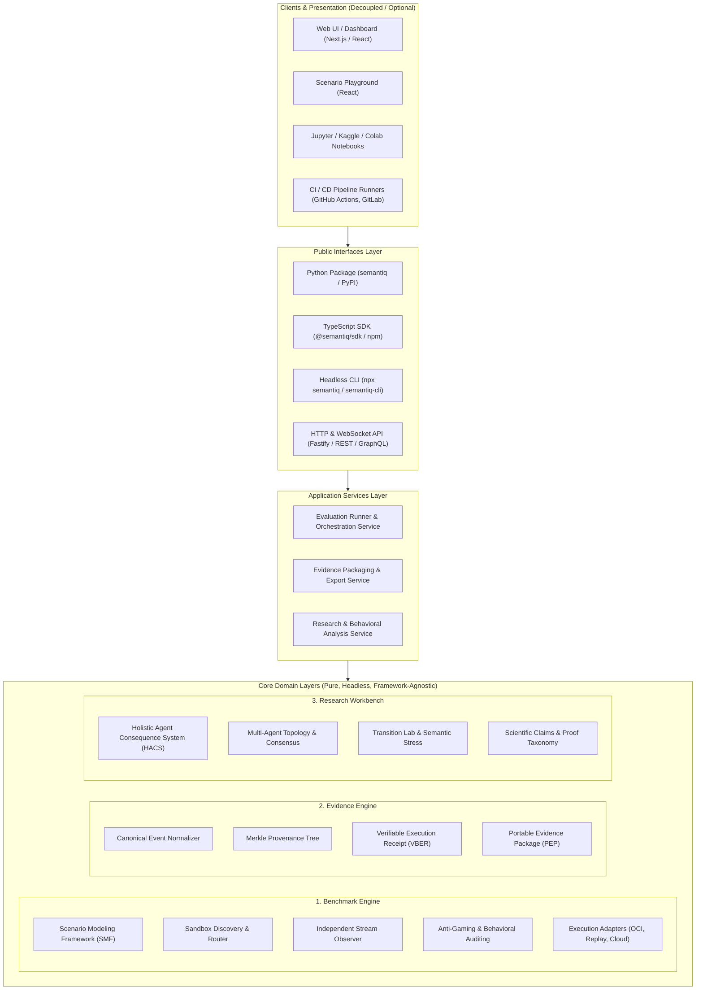
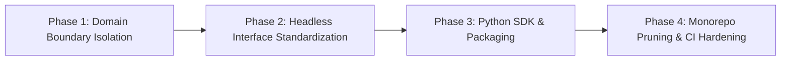

# ADR-0194: Headless SemantIQ Product Architecture & Domain Layering

## Status
Accepted

---

## 1. Context

Following the local baseline audit ([`current_repository_audit.md`](file:///c:/Users/Kaveh/Desktop/Tech-Club/docs/architecture/current_repository_audit.md)), SemantIQ is transitioning from an expansive monolithic social/question platform ("Tech Club") to a clean, production-grade **Headless AI Behavioral Benchmark & Evaluation Infrastructure** under **Logorythmus**.

The core value proposition of SemantIQ is independent, verifiable, and reproducible evaluation of autonomous AI agents across complex multi-step scenarios, economic boundaries, anti-gaming constraints, and long-horizon tasks.

To achieve maximum portability across headless CI runners, cloud clusters, local developer workstations, and data science environments (such as Jupyter, Google Colab, and Kaggle), the architecture must strictly separate core domain evaluation logic from transport layers, CLI runners, and graphical user interfaces.

---

## 2. Decision

We establish the canonical **Headless SemantIQ Product Architecture** organized into **Three Core Product Layers** and a separate **Interfaces Layer**, governed by a strict unidirectional dependency rule.



---

## 3. Core Product Layers

### Layer 1: Benchmark Engine
The execution foundation responsible for compiling scenarios, dispatching environments, capturing telemetry, and enforcing behavioral boundaries.
- **Scenario Modeling Framework (SMF)**: Declarative scenario definitions, constraints, prompt templates, and scoring rubrics.
- **Sandbox Discovery & Dispatch**: Provider-agnostic routing layer managing sandboxed execution across OCI containers, deterministic local mock replay, and remote cloud runtimes.
- **Independent Stream Observer**: Non-intrusive stream observer capturing token velocity, tool calls, anomalous behavioral spikes, and token economics.
- **Anti-Gaming & Behavioral Auditing**: Static and dynamic checks detecting prompt injection, benchmark leakage, synthetic reward hacking, and environment tampering.

### Layer 2: Evidence Engine
The cryptographic and provenance layer ensuring that every benchmark execution is indisputable, portable, and verifiable offline.
- **Canonical Event Normalizer**: Deterministic event normalization and sequence hashing.
- **Merkle Provenance Trees**: Hierarchical SHA-256 tree construction covering inputs, environment state, model interactions, and final artifacts.
- **Verifiable Benchmark Execution Receipts (VBER)**: Standalone cryptographic receipts signed with observer keys.
- **Portable Evidence Package (PEP)**: Self-contained, schema-validated bundles (`.tar.gz` / `.zip`) containing full execution traces, cryptographic receipts, and audit metadata.

### Layer 3: Research Workbench
The analytical and scientific modeling suite designed for frontier AI safety research and behavioral classification.
- **Holistic Agent Consequence System (HACS)**: Consequence tracking, failure injection, recovery analysis, and degraded-mode resilience.
- **Multi-Agent Topology & Consensus**: Validation of agent-to-agent delegation, negotiation, collective intelligence, and conflict resolution.
- **Transition Phenomena Laboratory & Semantic Stress**: Adversarial perturbation testing, edge-case sensitivity analysis, and phase-transition detection.
- **Scientific Claim Taxonomy**: Bounding evaluation outcomes to observable evidence, preventing ungrounded reasoning claims.

---

## 4. Separate Public Interfaces Layer

Public interfaces provide zero-overhead integration points across diverse environments without leaking transport concerns into domain logic:

1. **Python Package (`semantiq`)**:
   - Native PyPI distribution targeting Python `>=3.10`.
   - High-level functional APIs: `semantiq.evaluate()`, `semantiq.verify_receipt()`, `semantiq.load_dataset()`.
   - Native support for Pandas `DataFrame`, NumPy, and Jupyter / Kaggle export workflows.
2. **TypeScript SDK (`@semantiq/sdk`)**:
   - Zero-runtime-dependency TypeScript library for node and edge runtimes.
   - Programmatic access to runner, router, evidence verifiers, and custom adapter development contracts.
3. **Headless Developer CLI (`semantiq`)**:
   - Lightweight standalone executable: `semantiq run`, `semantiq verify`, `semantiq doctor`, `semantiq export`.
   - Designed for headless CI/CD execution with strict non-zero exit codes on evaluation failures.
4. **Headless HTTP / WebSocket API Server (`services/api`)**:
   - Fastify-based REST and WebSocket streaming server for remote evaluation clusters.
5. **Optional Decoupled UIs (`apps/*`)**:
   - Standalone web visualizers (`apps/benchmark`), scenario builders (`apps/playground`), and documentation portals (`apps/documentation`).
   - Consumers strictly interact via the public HTTP API or TypeScript SDK; zero direct domain imports.

---

## 5. Strict Dependency Direction & Boundary Rules

### 5.1. Unidirectional Dependency Flow
```text
Clients (UIs / Notebooks / CI)
      │
      ▼
Public Interfaces (Python / TS SDK / CLI / HTTP API)
      │
      ▼
Application Services (Runner / Evidence / Workbench Services)
      │
      ▼
Core Domain (Benchmark Engine / Evidence Engine / Research Workbench)
```

### 5.2. Prohibited Imports in Core Domain
The Core Domain packages (`packages/core`, `packages/benchmark`, `packages/evidence`, `packages/research`, `packages/sandbox-contracts`) must remain completely pure and headless.

**Core and Domain code MUST NOT import:**
- ❌ **FastAPI / Fastify / Express** or any HTTP server frameworks.
- ❌ **Typer / Commander / Yargs** or any CLI parser/terminal formatting tools.
- ❌ **React / Vue / Svelte / Solid** or any UI component libraries.
- ❌ **DOM APIs (`window`, `document`)** or Web UI modules.
- ❌ **Flutter / React Native** or mobile platform bindings.

### 5.3. Automated Architectural Boundary Enforcement
Architectural linting and automated boundary tests (`tests/architecture/package-boundaries.test.ts`) must enforce this constraint in CI. Any domain package importing a forbidden framework will fail the build immediately.

---

## 6. Monorepo Structure & Physical Layout

### 6.1. Monorepo Decision
**Decision**: The repository will **remain a single monorepo** managed via **pnpm workspaces** and **Turborepo**.

**Rationale**:
- **Atomic Contract Evolution**: Synchronized updates across Benchmark DSL, Evidence Schemas, TypeScript SDK, and Python SDK bindings.
- **Unified CI Quality Gate**: Single pipeline enforcing zero lint warnings, 100% Prettier formatting, TypeScript compilation, and Vitest suite execution.
- **Single Source of Truth**: Shared JSON Schemas (`schemas/`) validate all language implementations and evidence exports.

### 6.2. Target Physical Directory Layout
```text
Semantiq/
├── apps/                          # Decoupled optional presentation UIs
│   ├── benchmark/                 # Benchmark execution visualizer
│   ├── playground/                # Scenario authoring sandbox
│   └── documentation/             # Public documentation app
├── packages/                      # Headless Core & Domain Packages
│   ├── core/                      # DDD core primitives, entities & value objects
│   ├── benchmark/                 # Benchmark Engine (SMF, DSL, anti-gaming)
│   ├── evidence/                  # Evidence Engine (Merkle tree, VBER, PEP)
│   ├── research/                  # Research Workbench (HACS, multi-agent, stress lab)
│   ├── sandbox-contracts/         # Cross-language specifications & schema contracts
│   ├── sandbox-router/            # Provider routing & dispatch
│   ├── sandbox-tck/               # Technology Compatibility Kit
│   ├── adapters/                  # Execution adapters (OCI, Replay, Cloud)
│   ├── sdk/                       # TypeScript SDK (@semantiq/sdk)
│   ├── python/                    # Native Python Package (pyproject.toml, semantiq)
│   └── config/                    # Configuration, secrets & preflight checks
├── services/                      # Headless Backend Microservices
│   ├── api/                       # Fastify REST / WebSocket router
│   └── agent-runtime/             # Headless execution daemon
├── tools/                         # CLI Driver & Automation Tools
│   └── automation/                # Headless CLI (doctor, smoke, preflight, etc.)
├── schemas/                       # Canonical JSON Schema v7 definitions
├── docs/                          # Architecture ADRs, specifications & user guides
└── tests/                         # Unit, contract, integration & security test suites
```

---

## 7. Incremental Migration Strategy

To preserve **SMF**, **HACS**, and the **Vision** of decentralized, verifiable evaluation, migration will proceed in 4 incremental, non-breaking phases:



1. **Phase 1 — Domain Boundary Isolation**:
   - Verify that `@semantiq/core`, `@semantiq/benchmark`, and `@semantiq/evidence` have zero dependencies on UI/server packages.
   - Introduce architectural boundary enforcement tests.
2. **Phase 2 — Headless Interface Standardization**:
   - Consolidate TypeScript SDK under `@semantiq/sdk`.
   - Standardize CLI commands (`run`, `verify`, `doctor`, `preflight`, `export`) to operate 100% headlessly.
3. **Phase 3 — Python SDK & Packaging**:
   - Create standard `packages/python/pyproject.toml` with `hatchling` build backend.
   - Expose Python bindings mirroring `@semantiq/sdk` capabilities.
4. **Phase 4 — Monorepo Pruning & CI Hardening**:
   - Prune legacy social/question packages into optional or archived modules.
   - Enforce headless CI matrix across Linux, macOS, and Windows.

---

## 8. Consequences

### Positive
- **Headless Portability**: Evaluation can run in minimal Docker containers, CI pipelines, and cloud functions without Node UI or browser overhead.
- **Multi-Language Support**: Seamless parity between TypeScript and Python ecosystems sharing identical JSON Schema contracts and Merkle evidence formats.
- **Architectural Purity**: Core domain logic is isolated from web, framework, and rendering churn.
- **Preserved Vision**: Full continuity for SMF scenario models and HACS behavioral safety scoring.

### Negative & Mitigations
- **Discipline Required**: Developers cannot quickly import UI utilities or HTTP context into domain models.  
  *Mitigation*: Automated boundary tests in CI prevent accidental architectural leaks.
- **Dual-Language Maintenance**: TypeScript SDK and Python SDK must remain in lockstep.  
  *Mitigation*: JSON Schema contracts in `schemas/` act as the single source of truth for both languages.
