# SemantIQ / Tech-Club Current Repository Baseline Audit

**Date**: 2026-08-18  
**Repository Working Tree**: `c:/Users/Kaveh/Desktop/Tech-Club`  
**Git Branch**: `main`  
**Git Commit HEAD**: `8557bd9e069c9e8270a1b4140ec0a7c640c72be9`  
**Baseline Test Execution**: **174 test files passed, 10 skipped (184 total) | 626 tests passed, 36 skipped (662 total)** (58.37s)  
**Package Manager**: `pnpm@11.7.0`  
**Node Engine Target**: `>=22.0.0`  
**Python Tooling Baseline**: Python 3.12 (Ruff + Pytest configured in `pyproject.toml`; 1 example script `examples/kaggle/semantiq_starter.py`)

---

## 1. Executive Summary

This audit establishes the definitive baseline of the freshly pulled local SemantIQ repository prior to product migration towards the target **headless SemantIQ platform**.

The repository is structured as a TypeScript-first monorepo managed with **pnpm workspaces** and **Turborepo**, containing:
- **8 Web / Frontend Applications** (`apps/`)
- **143 Monorepo Packages** (`packages/`)
- **33 Microservices / Runtime Daemons** (`services/`)
- **4 Automation & Tooling Packages** (`tools/`)
- **35+ Contract Schemas** (`schemas/`)
- **193 Architectural Decision Records** (`Docs/adr/`)

The core behavioral evaluation engine (`packages/semantiq`, `packages/sandbox-contracts`, `packages/sandbox-router`, `packages/sandbox-tck`) contains complete specifications and verifiable execution receipt mechanisms for AI agent sandboxing. However, it remains embedded inside an expansive social/community question-engine platform ("Tech Club") requiring clear architectural decoupling.

---

## 2. Repository Architecture Map

```mermaid
graph TD
    subgraph ClientApplications["Client Applications (apps/)"]
        AppWeb["web (Next.js / React)"]
        AppAdmin["admin (Operations UI)"]
        AppBenchmark["benchmark (Visualizer)"]
        AppPlayground["playground (Evaluation Sandbox)"]
        AppDesktop["desktop (Electron / Native)"]
        AppMobile["mobile (React Native)"]
        AppDoc["documentation (Docusaurus)"]
    end

    subgraph CorePlatformServices["Core Platform Services (services/)"]
        SvcAPI["api (Fastify REST/GraphQL Router)"]
        SvcSemantiq["semantiq (Benchmark Service)"]
        SvcAgentRuntime["agent-runtime (Execution Host)"]
        SvcEvidence["evidence (Receipt Store)"]
        SvcQuestion["question (Domain Engine)"]
        SvcSearch["search / federated-search"]
    end

    subgraph SemantiqHeadlessEngine["SemantIQ Headless Evaluation Engine (packages/)"]
        PkgSemantiq["semantiq (Core Framework & CLI)"]
        PkgSandboxContracts["sandbox-contracts (Specs & Assertions)"]
        PkgSandboxRouter["sandbox-router (Provider Dispatch)"]
        PkgSandboxTCK["sandbox-tck (Compatibility Kit)"]
        PkgAdapters["adapters (Replay, OCI, Cloud, OpenSandbox)"]
        PkgCore["core (DDD Primitives & Kernel)"]
        PkgShared["shared (Domain Types & Errors)"]
        PkgConfig["config (Settings & Preflights)"]
        PkgEvidence["evidence (Provenance & Merkle Trees)"]
    end

    subgraph InfrastructureAndData["Storage & Infrastructure"]
        Postgres["PostgreSQL / pgvector"]
        Redis["Redis Cache"]
        LocalFs["Deterministic Local JSONL Mock"]
    end

    AppWeb --> SvcAPI
    AppPlayground --> PkgSemantiq
    SvcAPI --> SvcSemantiq
    SvcSemantiq --> PkgSandboxContracts
    PkgSandboxRouter --> PkgAdapters
    PkgAdapters --> LocalFs
    PkgSemantiq --> PkgCore
    PkgCore --> PkgShared
```



---

## 3. Dependency & Monorepo Structure

### 3.1. Workspaces Configuration (`pnpm-workspace.yaml`)
```yaml
packages:
  - "apps/*"
  - "packages/*"
  - "services/*"
  - "tools/*"
```

### 3.2. Monorepo Project Inventory Breakdown
| Layer | Directory | Project Count | Primary Role | Build Status |
|:---|:---|:---:|:---|:---:|
| **Applications** | `apps/` | 8 | Web, Admin, Desktop, Playground UIs | Scaffolded (`echo`) |
| **Domain Packages** | `packages/` | 143 | Evaluation, Sandboxing, Governance, AI Contracts | TypeScript / Scaffolds |
| **Backend Services** | `services/` | 33 | API Gateway, Agent Runtime, Storage Daemons | `tsc` (API) / Scaffolds |
| **Automation Tools** | `tools/` | 4 | CLI (`doctor`, `smoke`, `preflight`), Generators | Active `tsx` CLI |
| **Schemas** | `schemas/` | 37 | JSON Schema v7 validation contracts | Verified |
| **Documentation** | `Docs/` / `docs/` | 200+ docs | ADRs, Blueprints, Security & Economic specs | Active Markdown |

---

## 4. Public Interfaces & CLI Surface

### 4.1. Core CLI Entrypoints
1. **Automation CLI Driver** (`tools/automation/cli.mjs` / `pnpm doctor`, `pnpm smoke`, `pnpm preflight`, `pnpm connector`, `pnpm reproduce`, `pnpm export`):
   - `doctor`: Verifies Node version (>=22.0.0), pnpm, git repository status, and configuration files.
   - `preflight`: Validates model connector environment variables and API readiness.
   - `connector`: Validates live and mock model provider communication contracts.
   - `smoke`: Executes an offline behavioral evaluation, emits canonical decision events, and computes the Merkle root hash.
   - `reproduce`: Executes deterministic offline replay from stored trace fixtures.
   - `export`: Generates tarball/zip evidence packages containing execution receipts and audit metadata.
2. **SemantIQ Package CLI** (`packages/semantiq/src/cli.ts` / `npx semantiq`):
   - Command matrix: `run`, `doctor`, `preflight`, `evaluate`, `verify`, `export`.
3. **Legacy Shim** (`scripts/techclub.mjs`):
   - Proxies `dev`, `docs`, `benchmark`, and `graph` to underlying tools.

### 4.2. Public Programmatic APIs (`@semantiq/*`)
- `SemantiqRunner`: High-level evaluator orchestrating scenario execution, sandbox lifecycle, observer tracing, and receipt generation.
- `SandboxDiscoveryRouter`: Provider-agnostic routing layer with support for fallback and degraded modes.
- `IndependentObserver`: Non-intrusive stream observer capturing token velocity, tool calls, and anomalous behavioral spikes.
- `VerifiableBenchmarkExecutionReceipt`: Cryptographically hashed execution receipt carrying sha256 input hashes, token metrics, and observer signatures.

---

## 5. Coupling & Architectural Analysis

### 5.1. UI & Server Coupling
- **Legacy Web App Coupling**: `apps/web`, `apps/admin`, and `apps/playground` are tightly coupled to the legacy Question/Answer domain model (`packages/questions`, `packages/community`, `packages/reputation`).
- **REST/GraphQL API Layer**: `services/api` exposes unified routes that intermix social platform endpoints (`/api/v1/questions`) with agent benchmark execution endpoints (`/api/v1/semantiq/eval`).
- **State Management**: Frontend stores rely on mock in-memory stores with PostgreSQL fallback connectors.

### 5.2. File-Based & Data Coupling
- **File System Evidence Storage**: `packages/evidence` and `packages/sandbox-contracts` write output receipts directly to `artifacts/` and `tmp/` using local JSON/JSONL serialization.
- **Cross-Package Direct Path Imports**: Some test fixtures and internal scripts previously relied on relative directory hopping (`../../packages/...`) rather than workspace package exports (`@semantiq/...`).

---

## 6. Technical Debt & Inconsistencies

1. **Package Scope Fragmentation**:
   - Monorepo packages historically used mixed naming schemes (`@techclub/*` vs `@semantiq/*`).
   - Active canonical scope must remain strictly `@semantiq/*`.
2. **Version Metadata Discrepancies**:
   - Root `package.json` lists `0.1.0-alpha.1` while published artifacts target `0.1.0-alpha.2`.
3. **Upper / Lower Case Directory Paths**:
   - Legacy documentation resides in `Docs/` on Windows local disks while remote Linux CI expects lowercase `docs/`.
4. **Python Package Distribution Gap**:
   - `pyproject.toml` defines Ruff and Pytest settings but lacks standard `[project]` packaging metadata (`name`, `version`, `dependencies`, `entry-points`).
   - Only 1 Python script (`examples/kaggle/semantiq_starter.py`) exists; no published Python wheel is generated.

---

## 7. Baseline Test Execution Results

Executed on local baseline workspace (`c:/Users/Kaveh/Desktop/Tech-Club`):

```text
Test Files  174 passed | 10 skipped (184 total)
     Tests  626 passed | 36 skipped (662 total)
  Start at  15:03:52
  Duration  58.37s
```

- **Unit & Contract Suites**: 100% PASS (626 tests passed).
- **Skipped Tests (36 tests in 10 files)**: PostgreSQL-specific integration suites (`tests/integration/*postgres*.test.ts`) that gracefully skip when no live PostgreSQL server is detected on `localhost:5432`.

---

## 8. Migration Risks & Headless Target Gap Matrix

### 8.1. Identified Migration Risks
| Risk ID | Description | Severity | Mitigation Strategy |
|:---|:---|:---:|:---|
| **RISK-01** | Legacy domain logic in `packages/questions` blocking headless CLI decoupling | Medium | Isolate `@semantiq/core` and `@semantiq/sandbox-contracts` from legacy community packages |
| **RISK-02** | Case sensitivity collisions between `Docs/` and `docs/` across OS boundaries | High | Enforce lowercase `docs/` directory tree across all toolchains and CI |
| **RISK-03** | Python client / SDK packaging absent | Medium | Author standard `pyproject.toml` with `hatchling` / `flit` backend for Python SDK |
| **RISK-04** | UI apps depending on server endpoints that are deprecated during headless transition | Low | Keep UI apps decoupled as standalone consumers of `@semantiq/sdk` |

### 8.2. Target Headless SemantIQ Platform Gap Matrix
| Capability | Current State | Target Headless State | Gap / Action Required |
|:---|:---|:---|:---|
| **Autonomous Evaluation** | Supported via `pnpm smoke` & `pnpm reproduce` | Headless CLI / Daemon (`semantiq eval`) | Fully decoupled standalone runtime |
| **Provider Sandboxing** | Contracts in `sandbox-contracts` & mock replay | Pluggable OCI, Replay, and Cloud connectors | Complete adapter dynamic registration |
| **Evidence Receipts** | Merkle root & sha256 receipt generation | Standardized Portable Evidence Package (PEP) | JSON Schema v7 validation & export tooling |
| **Python Ecosystem** | 1 Kaggle starter script | Native `semantiq` Python SDK on PyPI | Add Python SDK wrapper around evaluation API |
| **CI Automation** | Strict Prettier + ESLint + Typecheck + Vitest | Headless CI matrix across Linux/macOS/Windows | Maintain zero-warning quality gate |

---

## 9. Baseline Audit Conclusion

The local SemantIQ repository possesses a verified and stable core evaluation foundation:
- **100% test pass rate** on all active offline unit, contract, and security suites (626 passing tests).
- **Complete contract definitions** for behavioral agent benchmarking, anti-gaming, economic accounting, and evidence provenance.
- **Clean modular separation potential** allowing headless SemantIQ extraction without breaking backward compatibility.
