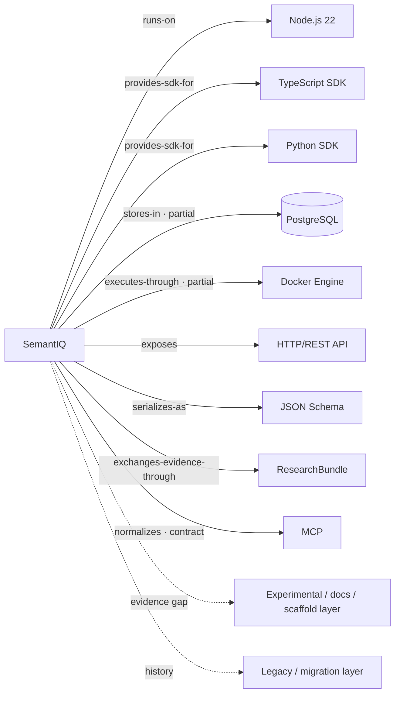

# SemantIQ Integration Graph v0.1

**Status:** Evidence-based repository map

**Source revision:** `302927cfd071285bbbe38961a08a0c58d77aa923`

**Machine-readable graph:** [`integration-graph.json`](integration-graph.json)

**Active claim decisions:** [`PUBLIC_CLAIM_STATUS.md`](PUBLIC_CLAIM_STATUS.md)

**Evidence-first priorities:**
[`UPSTREAM_ENGAGEMENT_PRIORITIES.md`](UPSTREAM_ENGAGEMENT_PRIORITIES.md)

## 1. Purpose

This graph records what SemantIQ actually runs on, stores in, executes through, exposes, imports,
exports, and uses for evidence exchange. Every relationship is classified from repository
implementation, test, and documentation evidence.

It is not a partnership, endorsement, adoption, certification, production-use, or external
scientific-validation map. Technology names identify technical relationships only.

## 2. Evidence boundary

- `VERIFIED_IMPLEMENTATION` means repository tests meaningfully exercise an implementation. It
  does not mean an upstream project has reviewed or endorsed SemantIQ.
- `IMPLEMENTED_PARTIAL` means code exists but important live-runtime, conformance, or independent
  evidence is missing.
- Internal or clean-room results remain internal evidence.
- A replication submission, including `SUCCESSFUL_REPRODUCTION`, is not automatically
  `VERIFIED_EXTERNAL_REPLICATION`.
- npm and PyPI packages remain unpublished. Local Hugging Face and Kaggle exporters do not prove
  platform publication.

## 3. How to read the graph

The textual tables below are normative. The compact Mermaid view is navigational only.

| Status | Meaning |
|---|---|
| `VERIFIED_IMPLEMENTATION` | Working code with meaningful repository test coverage |
| `IMPLEMENTED_PARTIAL` | Working code with a material runtime, conformance, or external-evidence gap |
| `CONTRACT_ONLY` | Interface/schema behavior without operational integration |
| `SIMULATED` | Intentional simulation rather than real external execution |
| `DOCS_ONLY` | Documentation without corresponding implementation |
| `SCAFFOLD` | Configuration/topology intended for later implementation |
| `HISTORICAL` | Legacy, migration-bound, or superseded relationship |

Confidence is independent of status: `HIGH` means the classification itself is strongly evidenced,
not that the relationship is complete. Depth is `DEEP`, `MODERATE`, or `SHALLOW`.

## 4. Primary evidence-backed graph

| Domain | Target | Relation | Status | Depth | Confidence | Evidence summary | Missing evidence |
|---|---|---|---|---|---|---|---|
| Runtime | Node.js 22 | `runs-on` | `VERIFIED_IMPLEMENTATION` | DEEP | HIGH | Runtime, Docker image and required CI | Cross-OS required CI |
| SDK/API | TypeScript SDK | `provides-sdk-for` | `VERIFIED_IMPLEMENTATION` | DEEP | HIGH | Client, contracts and compatibility tests | Published consumer validation |
| SDK/API | Python SDK | `provides-sdk-for` | `VERIFIED_IMPLEMENTATION` | DEEP | HIGH | Python 3.10–3.12 build/test matrix | Published consumer validation |
| Storage | PostgreSQL 16 | `stores-in` | `IMPLEMENTED_PARTIAL` | DEEP | HIGH | Migrations, repositories, HTTP composition, opt-in real tests | Required live-Postgres CI |
| Execution | Docker Engine | `executes-through` | `IMPLEMENTED_PARTIAL` | MODERATE | HIGH | Engine API client, adapter, stream and Compose checks | Live daemon lifecycle gate |
| Execution | OCI contract | `validates-with` | `CONTRACT_ONLY` | MODERATE | MEDIUM | Provider-neutral execution contracts | Cross-engine conformance |
| Reproduction | Replay adapter | `reproduces-with` | `VERIFIED_IMPLEMENTATION` | DEEP | HIGH | Deterministic replay implementation and tests | Independent consumer fixture |
| SDK/API | HTTP/REST | `exposes` | `VERIFIED_IMPLEMENTATION` | DEEP | HIGH | Local server, routes and API tests | External client conformance |
| Contracts | JSON Schema 2020-12 | `serializes-as` | `VERIFIED_IMPLEMENTATION` | DEEP | HIGH | Schemas plus TS/Python parity gates | Independent validator |
| Evidence | Canonical JSON/SHA-256 package | `serializes-as` | `VERIFIED_IMPLEMENTATION` | DEEP | HIGH | Hashing, package and provenance tests | Cross-language verifier |
| Evidence | ResearchBundle | `exchanges-evidence-through` | `VERIFIED_IMPLEMENTATION` | DEEP | HIGH | Builder, verifier, partner exchange tests | Third-party consumption |
| Reproduction | Independent Replication Report | `exchanges-evidence-through` | `VERIFIED_IMPLEMENTATION` | DEEP | HIGH | Live issue form and policy regression test | Accepted independent submission |
| Benchmark exchange | External benchmark pack | `imports-from` | `IMPLEMENTED_PARTIAL` | MODERATE | MEDIUM | Generic mapper, fixture and tests | Format semantics, schema, license and provenance validation |
| Execution | MCP | `normalizes` | `CONTRACT_ONLY` | MODERATE | HIGH | Call/result contracts and normalization tests | Real transport/server execution |
| Benchmark exchange | Hugging Face format | `exports-to` | `IMPLEMENTED_PARTIAL` | MODERATE | MEDIUM | Record/card generator and tests | Tool/API round trip and publication evidence |
| Benchmark exchange | Kaggle format | `exports-to` | `IMPLEMENTED_PARTIAL` | MODERATE | MEDIUM | Metadata/export code and tests | Namespace decision, tool validation, publication evidence |
| Research exchange | CFF/CodeMeta/DataCite | `serializes-as` | `IMPLEMENTED_PARTIAL` | MODERATE | HIGH | Checked-in metadata and local tests | Official validation and registration |

## 5. Evidence-gap / experimental surface

These relationships must not be described as verified integrations.

| Target | Status | What exists | What is missing |
|---|---|---|---|
| OpenSandbox | `IMPLEMENTED_PARTIAL` | HTTP protocol client and adapter | Canonical upstream identity and live-daemon conformance |
| Browser/GUI provider | `CONTRACT_ONLY` | Contracts and normalization tests | Provider adapter and real browser journey |
| Podman | `DOCS_ONLY` | Documentation claims | Podman-specific runtime proof |
| E2B | `SIMULATED` | Simulated adapter, budget and redaction tests | Real E2B execution |
| OpenAI / Anthropic / Google GenAI | `DOCS_ONLY` | Guides, fixture names or disabled flags | Functional connectors and opt-in safety tests |
| Ollama | `DOCS_ONLY` | Diagnostic/configuration references | Request/response adapter and fallback test |
| Redis / Neo4j / MinIO | `SCAFFOLD` | Compose/configuration/descriptors | Consumers and integration tests |
| OpenTelemetry | `SCAFFOLD` | OTLP endpoint variable | SDK/exporter implementation |
| Prometheus / Grafana / MailHog | `SCAFFOLD` | Compose containers | Metrics, dashboards or mail workflow |
| npm / PyPI | `SCAFFOLD` | Package metadata and build capability | Authorized publication and registry-install proof |
| Zenodo | `DOCS_ONLY` | Metadata and prospective release text | Verified deposition and DOI |
| GitHub Pages deployment | `DOCS_ONLY` | Static-site build and validation | Upload/deploy action and live-site proof |

## 6. Historical / migration layer

| Identity or record | Status | Boundary |
|---|---|---|
| `tech-club` / `techclub` | `HISTORICAL` / `MIGRATION_BOUND` | Legacy root scripts and environment identity |
| `@tech-club/*` | `HISTORICAL` / `MIGRATION_BOUND` | Internal workspace namespace, not an external organization |
| `techclub/*` Kaggle IDs | `HISTORICAL` / `MIGRATION_BOUND` | Export identity requiring a human namespace decision |
| `Semant-iq` URLs | `HISTORICAL` | Preserved repository and migration history |
| Publication-verification reports | `HISTORICAL` | Local metadata checks, not proof of external publication |

No namespace migration or historical rewrite is performed by this graph.

## 7. Strategic ecosystem candidates

The strongest evidence-backed relationships for future technical work are PostgreSQL, Docker/OCI,
JSON Schema, the Python and TypeScript SDKs, HTTP/REST, canonical evidence packages,
ResearchBundle exchange, the independent-replication interface, external benchmark formats, MCP,
OpenSandbox, and the Hugging Face/Kaggle export formats.

This ranking identifies technical relevance, not outreach authorization. No relationship is
currently promoted to `READY_FOR_TECHNICAL_ENGAGEMENT` solely by this graph.

## 8. Missing evidence

Highest-priority gaps are:

1. Require or separately gate real PostgreSQL integration in CI.
2. Exercise Docker create/execute/terminate against a live daemon.
3. Replace generic benchmark mappings with authentic format-specific fixtures and provenance checks.
4. Exercise MCP and OpenSandbox against identified reference implementations.
5. Reconcile model-provider, Podman, Ollama, publication, Pages, and platform-support claims with
   actual implementation evidence.

## 9. Contribution opportunities

Credible future work includes PostgreSQL concurrency/JSONB fixtures, Docker lifecycle conformance,
cross-language schema/hash vectors, SDK consumer tests, ResearchBundle verification fixtures,
format-specific benchmark import tests, and real MCP/OpenSandbox protocol checks. An upstream issue
or PR is appropriate only after a minimized technical finding exists; the graph itself is not a
reason for outreach.

## 10. Outreach boundary

No graph edge implies partnership, endorsement, adoption, official compatibility, publication, or
production use. `LATER_NEEDS_MORE_EVIDENCE`, `DEPENDENCY_ONLY_NO_OUTREACH`, and
`NOT_CURRENTLY_APPROPRIATE` are the only outreach states in v0.1.

## 11. Machine-readable graph

[`integration-graph.json`](integration-graph.json) is canonical for node identities, edge metadata,
evidence paths, confidence, missing evidence, and outreach readiness. Focused tests reject invalid
nodes, vocabularies, evidence paths, layer promotion, simulation promotion, publication claims, and
external-replication overclaims.
