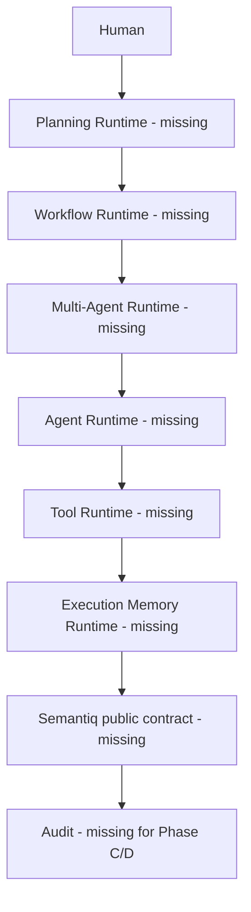

# Phase D Final Report

## Executive Summary

**Phase D Decision: NO-GO.** Phase D produced repository audits and explicit boundary documentation only. Phase C supplied no Semantiq public contracts, and Phase D Prompts 1-6 each failed their mandatory parent gate. No unified kernel or Phase D runtime was implemented.

## Architecture Diagram

The intended architecture remains uninstantiated:

## Runtime Dependency Map

All requested dependency nodes are blocking. Legacy code collapses boundaries and is not accepted as the map.

## Component Inventory

| Component                 | Status                             |
| ------------------------- | ---------------------------------- |
| Agent Runtime             | Missing; legacy duplicates audited |
| Tool Runtime              | Missing                            |
| Workflow Runtime          | Missing; legacy duplicates audited |
| Multi-Agent Runtime       | Missing                            |
| Execution Memory Runtime  | Missing                            |
| Planning Runtime          | Missing                            |
| Runtime Kernel            | Missing                            |
| Semantiq public contracts | Missing                            |

## Public Contracts

None for Phase C or Phase D. Phase B Question Runtime remains the last stable public runtime boundary.

## Event Catalog

No Phase D event is implemented or versioned.

## API Catalog

No Phase D API is implemented. Static route descriptors are excluded.

## Persistence Summary

No Phase C/D table or migration exists. The single linear repository migration head remains `8 question_runtime_closure` from Phase B.

## Security Assessment

Failed readiness. Required authorization, sandbox, workflow integrity, messaging, replay, planning approval, recovery, and cross-runtime contract controls are absent. No new execution surface was introduced.

## Privacy Assessment

Failed readiness. No Phase D logging, event, context, snapshot, replay, diagnostic, retention, or access policy exists. No new data collection was added.

## Performance Baseline

Not Executed. There is no authoritative runtime operation or representative Phase D dataset to measure.

## Regression Results

Not Executed for Phase D. Prior Phase B evidence was not relabeled as Phase D validation.

## Technical Debt

- recover Phase C Prompts 1-7
- implement Phase D Prompts 1-6 in dependency order
- establish one authority for Agent and Workflow domains
- migrate or remove misleading alias packages and static healthy descriptors
- add durable persistence, security, tests, Docker evidence, limits, and operations contracts

## Deferred Work

All Phase D runtime implementation. Prohibited external AI, network, cloud, distributed, MCP, browser, hidden-memory, and autonomous behavior remains deferred or excluded.

## Readiness Assessment

Phase D is not complete and Implementation Cycle 2 must not begin.
