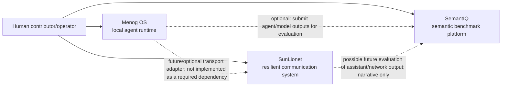

# Logorythmus Three-Tool Migration Manifest

**Status:** Read-only evidence report; no migration authorized  
**Date:** 2026-07-22  
**Scope:** Local candidates associated with the proposed Logorythmus ecosystem  
**Decision state:** Provisional; all repository names and canonical checkout choices require human approval

## A. Executive Summary

The local machine contains many project directories, including multiple copies or generations of Menog OS, SemantIQ, and SunLionet. The evidence supports three provisional product identities:

1. **Menog OS** — a TypeScript/pnpm local-first agent runtime foundation.
2. **SemantIQ** — a Python/FastAPI/CLI platform for semantic-cognitive LLM benchmarking, with a separate frontend.
3. **SunLionet** — a Go/Kotlin/TypeScript offline-first resilient communication system with Inside, Outside, Android, and web surfaces.

These are the strongest candidates because each has a distinct human problem, an independently explainable product boundary, implementation and tests, a public Git identity, and no demonstrated mandatory dependency on either of the other two.

The selection is **not yet safe to migrate**. The principal uncertainties are:

- Menog OS has two local roots with materially different states and conflicting Apache-2.0 versus AGPL/open-core licensing claims. `../Agent-os` is the only clean, remote-backed canonical candidate; `../Menog.os` has no commits and should not be treated as history.
- SemantIQ has two divergent remote-backed implementations using the same public remote plus an unversioned third copy. Their package names, licenses, feature surfaces, and documentation differ. The recommended canonical product checkout (`../SemantIQ`) contains uncommitted product changes and an ignored local `.env` file.
- SunLionet has two remote-backed copies of the same public repository. `../Iran-Agent-Vpn` is clean and 58 commits deep; `../Sunlionet-push` is 14 commits behind its remote with hundreds of local modifications. The clean checkout is the safer evidence baseline despite its obsolete local folder name.
- SunLionet tracks large release binaries, archives, an Android AAR, a 52 MB video, and a 17 MB PDF. Publication and provenance policy must be decided before transfer.
- Potential credential/configuration matches were recorded by location only. No match was treated as a confirmed secret and no matched value is reproduced here.

**Recommended pilot:** Menog OS from `../Agent-os`, after the license/open-core claims and external adapter claims are reviewed. It is clean, small, documented, remote-backed, and has the lowest observed migration risk.

**Repository creation verdict:** **NO-GO** until the Human Decision Gate in section I is approved and all Critical/High risks are closed.

### Evidence methodology and limitations

- Inspected top-level desktop directories, nested Git roots to depth four, READMEs, manifests, source/test layout, licenses, remotes, branch status, tracked artifacts, documentation indexes, and entry-point declarations.
- Did not install dependencies or execute builds/tests because installations and workspace mutations were prohibited. Build/test capability is therefore **declared and structurally supported**, not freshly proven by this audit.
- Source/test counts exclude common dependency, build, cache, coverage, and Git directories. Counts are orientation evidence, not quality metrics.
- Secret scanning was heuristic and reported filenames only. A purpose-built history-aware secret scan is still required before publication.
- The current planning root is not a Git repository, so saving this report here does not modify a tracked product repository.

## B. Candidate Project Index

### Strong ecosystem candidates and alternate copies

| Candidate | Local path | Classification | First-three decision |
|---|---|---|---|
| Menog OS clean checkout | `../Agent-os` | Implemented Phase 1 foundation; clean remote-backed Git root | **Select provisionally** |
| Menog OS uncommitted copy | `../Menog.os` | Uncommitted alternate generation; no Git commits; broad claims | Reject as canonical history; compare only |
| SemantIQ platform | `../SemantIQ` | Partially implemented/experimental platform; remote-backed; dirty | **Select provisionally** |
| SemantIQ-M-Benchmarks | `../SemantIQ-M-Benchmarks` | Implemented research benchmark variant; divergent identity; dirty deletions | Reject as separate first repository; resolve lineage with SemantIQ |
| SemantIQ alternate copy | `../Sematiq 2` | Unversioned alternate platform copy with local DB/output files | Reject as canonical; compare for missing work only |
| SunLionet clean checkout | `../Iran-Agent-Vpn` | Implemented experimental/alpha product; clean remote-backed Git root | **Select provisionally** |
| SunLionet working copy | `../Sunlionet-push` | Same remote; behind 14; hundreds of modifications and untracked assets | Reject as migration baseline; preserve pending work separately |
| Semantic Wallet | `../Lockal-Crypto-Semantic-Geometry` | Implemented sandbox nested under near-empty wrapper; only three commits | Defer: boundary, documentation, license, and product identity insufficiently clear |
| Tech Club Meta Architect | `../Tech-Club-Skill` | Substantial local project core; unlicensed/private metadata; many local changes | Defer: not currently Open Source and not one of the established public identities |
| Tech Club | `.` | Large unversioned ecosystem/product workspace with extensive aspirational scope | Reject as first product repo; planning/integration workspace, not a clear independent tool migration |

### Other discovered top-level candidates

The following were indexed so the trio was not selected merely from the most visible folders. They were rejected from the first migration because current evidence does not connect them strongly enough to the approved three-tool ecosystem, or because they are prototypes, data, third-party checkouts, infrastructure exercises, models, or unclear folders.

| Candidate path | Evidence summary | Why not one of the first three |
|---|---|---|
| `../ADK agent` | Directory; no root manifest/README detected | Product boundary and implementation unclear |
| `../Agent-Trader` | Python manifest and README | Separate trading use case; no demonstrated Logorythmus role |
| `../AgentCloud` | “Cloud Studio MVP”; nested frontend Git root | Different cloud product; unclear ownership and boundary |
| `../Amazon- scrap` | Git project; API integration; heavily dirty | Specialized integration and high migration risk |
| `../Arche-io` | No root identity evidence | Unclear |
| `../Beweise agent` | Project-basis/prompt documentation | Appears foundation/proposal rather than mature tool |
| `../body-organ-galss-modell` | No root identity evidence | Model/experiment boundary unclear |
| `../cloud agent` | Nested project roots | Unclear umbrella/duplicate cloud experiment |
| `../Cloud-Agent` | Project setup with nested repositories | Multi-project staging area; no single canonical boundary |
| `../Dart-agen-appt` | Flutter and backup nested roots | Application experiment with duplicate copy |
| `../digify agent` | No root evidence | Unclear |
| `../editor-mcp-server` | Clean Git/npm project | Independent MCP utility; no established ecosystem role |
| `../flix-robot` | No root evidence | Unclear |
| `../gemini-cli` | Directory without root identity evidence | Likely external/upstream tooling; provenance unresolved |
| `../Humanoid-modell` | No root identity evidence | Model/experiment, not demonstrated product |
| `../Iranshahr-Os` | Nested atlas Git root | Separate project family |
| `../Langgraph-agent` | Shop Agent Next.js/LangGraph project | Specialized prototype |
| `../Logicnet` | Large family with many nested Git roots | Separate research ecosystem explicitly distinguished from Tech Club in local documentation |
| `../Lokal-Agent-Google-Chrome` | No root identity evidence | Unclear prototype |
| `../Lotto` | LogicNet versions, Python requirements | LogicNet research/prototype, not selected ecosystem tool |
| `../Menod.io-Code-Agent-Skill` | Node workspace with nested projects | Alternate/unrelated skill workspace; identity unresolved |
| `../Modells` | No root identity evidence | Asset/model collection, not a product boundary |
| `../Mullti-Agent-Shader-Ollama` | Local scaffold README | Experimental scaffold |
| `../n8n` | Directory without root evidence | Likely third-party/tooling; provenance unresolved |
| `../N8Ns` | Directory without root evidence | Workflow collection, not demonstrated product |
| `../Neuer Ordner` | Generic unnamed folder | No stable identity |
| `../Novanuss` | No root identity evidence | Unclear |
| `../praisonai` | PraisonAI/Pulumi MCP test project | Third-party integration experiment |
| `../SAM-AWS` | No root identity evidence | Infrastructure exercise/unclear |
| `../Siam-Os-Auto` | No root identity evidence | Unclear |
| `../Terraform` | Nested getting-started Git project | Training/infrastructure material |
| `../video-agent` | Nested movie AI frontend | Separate media prototype |
| `../wörterbuch-dataset` | Dataset directory | Data asset, not an independently evidenced tool |

### Nested Git roots

Numerous nested Git repositories also exist under Cloud-Agent, Logicnet, Iranshahr-Os, Dart-agen-appt, video-agent, and other staging folders. They should be audited only if a future human decision expands the ecosystem scope. Their presence is itself a warning against copying broad parent directories into new repositories.

## C. Three-Tool Migration Manifest

### Tool 1 — Menog OS

| Field | Required information |
|---|---|
| Current local name | `Agent-os` (README/package identity: **Menog OS**) |
| Local path | `../Agent-os` |
| Proposed repository name | `menog-os` |
| Alternative repository names | `menog`, `menog-runtime` |
| One-sentence purpose | Provides a local-first TypeScript runtime foundation for registering, coordinating, policy-governing, storing, and observing local AI agents. |
| Human problem | Helps people run and inspect agent workflows locally without making a cloud service the mandatory control plane. |
| Primary users | Developers and operators building local/private AI-agent workflows; regulated/privacy-sensitive teams are claimed target users but not validated here. |
| Current maturity | Experimental / Phase 1 foundation (`0.1.0`) |
| Implementation status | 103 source files and 26 test-named files observed; runtime daemon/dashboard and packages for runtime core, agent kernel, event bus, policy engine, local store, shared types, and provider boundaries are present. README declares `phase1:check`, `phase1:dev`, build and Vitest workflows. Actual checks were not rerun. |
| Known limitations | README describes several integrations as adapter boundaries/placeholders; “compliance-ready,” “WebGPU-accelerated,” and complete open-core framing exceed what was freshly verified. External model/TTS/agent integrations require claim-by-claim review. |
| Main entry point | Local runtime daemon plus dashboard; pnpm scripts |
| Technology stack | TypeScript, Node.js 20+, React, pnpm workspaces, Turbo, Vitest, Biome |
| Build method | `pnpm phase1:build` or `pnpm build` (declared) |
| Test method | `pnpm phase1:check` / `pnpm test` (declared) |
| Dependency manager | pnpm 9.15.0 |
| License | Apache-2.0 in selected checkout; high confidence for its current files, but ecosystem decision unresolved because alternate checkout claims AGPL-3.0/open-core/commercial terms |
| Third-party concerns | PrismML/Bonsai, Pi-Agent, Supertonic, WebGPU adapter boundaries and commercial-extension language require attribution, trademark, implementation, and distribution review |
| Git status | Git root; `main`; remote `Menog-Os/Menog.os`; one commit; clean and aligned with `origin/main` |
| History recommendation | Preserve the remote-backed history, but first decide whether one commit is sufficient provenance and whether the uncommitted alternate copy contains legitimate later work |
| Existing public identity | Public remote and package identity use Menog OS / `menog-os`; scoped packages use `@menog-os/*` |
| Rename cost | **Medium** — public repo uses `Menog.os`; manifests/packages use `menog-os`; renaming the repository affects URLs but preserves the dominant spoken/package identity |
| Maintainer | Unknown from accountable-human evidence; repository is under the `Menog-Os` GitHub organization and files name “Menog OS contributors” |
| Relationship to Tool 2 | Conceptual/optional: SemantIQ could evaluate agent output; no mandatory code dependency observed |
| Relationship to Tool 3 | Conceptual/optional: SunLionet could provide communication/transport; no mandatory code dependency observed |
| Documentation condition | Mixed: useful current architecture/development docs plus forward specs and open-core/compliance claims requiring labels |
| Migration risks | Conflicting alternate license; one-commit history; external integration claims; potential secret-language matches in adapter docs/tests; PDF session summary; unclear commercial boundary |
| Readiness blockers | Approve canonical checkout; settle license; verify build/test from clean clone; classify specs; verify third-party rights; rewrite unverifiable maturity/compliance claims; name accountable maintainer |

### Tool 2 — SemantIQ

| Field | Required information |
|---|---|
| Current local name | `SemantIQ` |
| Local path | `../SemantIQ` |
| Proposed repository name | `semantiq` |
| Alternative repository names | `semantiq-platform`, `semantiq-benchmarks` |
| One-sentence purpose | Runs configurable semantic-cognitive evaluations of language-model outputs through a Python CLI/API and stores benchmark runs and scores, with a separate web frontend. |
| Human problem | Helps model evaluators compare more than simple answer accuracy by organizing reproducible semantic/reasoning-oriented benchmark runs and reports. |
| Primary users | AI researchers, model evaluators, developers, educators/reviewers experimenting with LLM evaluation |
| Current maturity | Experimental / alpha (`0.1.0`) |
| Implementation status | 226 source files and 22 test-named files observed; Python package, `semantiq` CLI entry point, FastAPI API, providers, runner, storage/database modules, benchmark/dataset configuration, tests, Docker and frontend exist. Build/test was not rerun. |
| Known limitations | Root README is only one sentence; working tree has ten modified tracked files and five untracked frontend feature directories; cloud/runtime surfaces appear incomplete; claims differ from SemantIQ-M-Benchmarks; tracked sample outputs may be generated or contain model data |
| Main entry point | Python CLI `semantiq`; FastAPI service; web frontend |
| Technology stack | Python 3.11+, Pydantic, FastAPI, Typer, httpx, Hatchling; TypeScript/Next-style frontend; Docker; optional PostgreSQL/Redis workers |
| Build method | PEP 517/Hatchling via `pip install -e .`; frontend build method requires repository-specific confirmation |
| Test method | `pytest` with tests under `tests`; Ruff/Black declared; exact verified command unknown until clean-clone run |
| Dependency manager | Python package metadata/pip; frontend Node dependency manager requires confirmation |
| License | MIT file and `pyproject.toml` agree in selected checkout; high confidence for code in this checkout. Dataset/output licensing remains separate. |
| Third-party concerns | Provider APIs; benchmark datasets/prompts; generated model outputs; possible OpenAI/OpenRouter/Grok references; dataset and model-output rights/attribution need review |
| Git status | Git root; `main`; remote `kaveh8866/SemantIQ`; eight commits; aligned with remote but dirty (10 modified tracked files, 5 untracked frontend directories) |
| History recommendation | Preserve remote history after reconciling working changes. Do not combine blindly with SemantIQ-M-Benchmarks, which has divergent code, license metadata, and deleted UI files. |
| Existing public identity | Public repository `kaveh8866/SemantIQ`; Python package name `semantiq`; CLI `semantiq`; internal URLs use SemantIQ |
| Rename cost | **Low to medium** — lowercase repository spelling is consistent with the package/CLI but changes the current case-sensitive display/URL convention and existing links |
| Maintainer | Accountable human not explicitly established in governance files inspected; current public repository owner account is the strongest evidence |
| Relationship to Tool 1 | Optional conceptual integration: evaluate agent/model outputs; no mandatory dependency observed |
| Relationship to Tool 3 | None required; possible future evaluation of assistant/network components is narrative only |
| Documentation condition | Fragmented and mixed: minimal root README, architecture/security/privacy/release documents, plus a separate documentation-rich benchmark variant |
| Migration risks | Dirty tree; ignored `.env`; multiple divergent copies sharing one remote; potential secret/config matches; tracked generated JSONL outputs; dataset licensing; incomplete root documentation; provider configuration |
| Readiness blockers | Choose product boundary versus M-Benchmarks; reconcile changes; scan full history; remove or justify generated outputs; verify datasets/prompts licenses; write truthful README; verify build/tests; identify maintainer |

### Tool 3 — SunLionet

| Field | Required information |
|---|---|
| Current local name | `Iran-Agent-Vpn` (README/product identity: **SunLionet**) |
| Local path | `../Iran-Agent-Vpn` |
| Proposed repository name | `sunlionet` |
| Alternative repository names | `sunlionet-network`, `sunlionet-agent` |
| One-sentence purpose | Provides signed/encrypted configuration bundles, local policy and profile handling, Inside/Outside Go binaries, an Android VPN wrapper, and local dashboard tooling for resilient communication in restricted networks. |
| Human problem | Helps users and trusted supporters exchange and apply connectivity configurations when networks are restricted or unreliable while minimizing centralized coordination. |
| Primary users | Users in restricted networks, trusted supporters/operators, Android/Linux testers, security reviewers |
| Current maturity | Experimental / alpha; repository includes `v0.1.0` artifacts and a 1.0-readiness document, but production readiness was not verified |
| Implementation status | 1,207 source files and 144 test-named files observed; Go Inside/Outside commands, bundle/signature/encryption modules, profile/policy/detection code, Android app, website/dashboard, tests, and release workflows exist. Clean checkout has 58 commits. Build/test was not rerun. |
| Known limitations | Depends optionally on `sing-box`; some legacy naming remains in paths/protocols/artifacts; high-risk network claims demand independent security review; tracked release artifacts and site content may not match current source; Go 1.25 availability/compatibility must be verified |
| Main entry point | Go `cmd/inside` and `cmd/outside`; Android application; local/web dashboard |
| Technology stack | Go 1.25, Kotlin/Android, TypeScript/Next.js-style website, shell/PowerShell, Docker |
| Build method | `go build` with `inside`/`outside` tags; Android/website workflows also present; declared scripts and CI require clean verification |
| Test method | PowerShell/shell test scripts and Go tests; Android/web test material exists |
| Dependency manager | Go modules; Gradle for Android; Node package manager for website requires confirmation |
| License | MIT file; high confidence for repository-level declaration, but bundled binaries/assets and dependencies need artifact-level provenance |
| Third-party concerns | `sing-box`, age/crypto libraries, Android AAR, bundled release binaries, brand assets, website media, example identity/key material, translated content, possible Signal references/trademarks |
| Git status | Git root; `main`; remote `kaveh8866/Sunlionet`; 58 commits; clean and aligned with `origin/main` |
| History recommendation | Preserve clean remote-backed history. Reconcile the `Sunlionet-push` working copy separately; do not overwrite or merge it mechanically. |
| Existing public identity | Public repository `kaveh8866/Sunlionet`; product README and documentation use SunLionet; module path uses `github.com/kaveh/sunlionet-agent`; legacy paths still exist |
| Rename cost | **Medium** — public repository already matches case-insensitively, but module path, legacy package paths, release names, website links, and Android identifiers may need coordinated changes later |
| Maintainer | Accountable human is not explicitly proven; license/public repository owner provide authorship evidence but governance accountability needs confirmation |
| Relationship to Tool 1 | Optional conceptual transport/integration; no mandatory dependency observed |
| Relationship to Tool 2 | No mandatory dependency observed |
| Documentation condition | Extensive but mixed: user guides, architecture, security, governance, release, implementation specs, translations, blog/marketing, and future-phase documents coexist |
| Migration risks | High-risk security claims; sensitive test fixture review; ignored `.env.local`; large tracked binaries/media; machine paths in docs; legacy naming; duplicate dirty checkout; artifact provenance; public-safety implications |
| Readiness blockers | Independent security/threat-model review; artifact/source provenance decision; full secret/history scan; reconcile dirty duplicate; classify future claims; verify build/tests; validate user-safety documentation; identify maintainer/security contact |

## D. Relationship Map

### Dependency findings

| Relationship | Type | Mandatory now? | Evidence verdict |
|---|---|---:|---|
| Menog OS → SemantIQ | Conceptual/possible API integration | No | No package/import dependency observed |
| Menog OS → SunLionet | Conceptual/possible secure transport | No | No package/import dependency observed |
| SunLionet → SemantIQ | Narrative/possible evaluation | No | No technical dependency observed |
| Shared schemas/config/models | None established across canonical roots | No | Similar vocabulary is not a stable shared abstraction |
| Independent installation | Yes, structurally | Yes | Separate runtimes/manifests and entry points |
| Independent version/release | Yes, structurally | Yes | Separate Git histories and version metadata |

No shared library should be created now. If small helpers or schema concepts are duplicated, keep them local until at least two tools demonstrate the same stable contract through actual integrations and releases.

## E. Risk Register

| Severity | Tool | Location | Risk | Recommended action |
|---|---|---|---|---|
| Critical | Menog OS | `../Agent-os` vs `../Menog.os` | Conflicting Apache-2.0 and AGPL/open-core/commercial licensing narratives across alternate copies | Human/legal decision on canonical license and commercial boundary before migration |
| Critical | SunLionet | `../Iran-Agent-Vpn` security-sensitive code and docs | Product is intended for high-risk restricted networks; incorrect security claims could endanger users | Independent security review and conservative maturity/safety wording before public endorsement or release |
| High | SemantIQ | `../SemantIQ` | Dirty working tree with uncommitted backend/frontend work | Preserve changes separately; choose exact migration snapshot; never migrate an accidental mixed state |
| High | SemantIQ | `../SemantIQ`, `../SemantIQ-M-Benchmarks`, `../Sematiq 2` | Three divergent local identities; two point to same public remote; licenses/features differ | Produce file/history comparison and approve a canonical boundary; do not merge automatically |
| High | SunLionet | `../Sunlionet-push` | Same remote as canonical candidate, behind 14 commits with hundreds of modified/untracked files | Back up and review separately; decide whether changes are valid work before selecting final snapshot |
| High | SunLionet | `Brandkit/SunLionet_Blueprint.pdf`, `android/app/libs/sunlionet.aar`, `website/public/downloads/v0.1.0/*`, `website/src/app/video/Sunlionet.mp4` | Large tracked binary/media/release artifacts; source, license, reproducibility, and history bloat unresolved | Establish artifact provenance and release-storage policy; move reproducible binaries to Releases after approval |
| High | SemantIQ | `.env` (ignored local file) | Local environment file exists; contents not inspected or reproduced | Confirm ignored status across history and perform dedicated secret scan before export |
| High | SunLionet | `.env.local` (ignored local file) | Local environment file exists; contents not inspected or reproduced | Confirm ignored status across history and perform dedicated secret scan before export |
| High | SunLionet | `testdata/sample_age_identity.txt` | Private-key/identity-shaped test fixture may be intentionally synthetic but is security-sensitive | Cryptographically verify it is non-production generated test material and label it clearly or regenerate fixture |
| Medium | SemantIQ | `outputs/run_gemini.jsonl`, `outputs/scores_gemini.jsonl` | Tracked generated model outputs may contain licensed/provider-derived or sensitive prompt content | Human content/license review; exclude, sanitize, or move to documented fixtures/datasets |
| Medium | SemantIQ | files listed by heuristic scan under `.github/workflows`, `config`, `examples`, `frontend`, `infra`, `scripts`, `src/semantiq` | Credential/configuration vocabulary detected; no confirmed secret | Run history-aware scanner; manually verify defaults/placeholders without publishing values |
| Medium | Menog OS | `docs/specs/phase-1.2-local-ai-stack.md`, `docs/specs/phase-1.2-pi-bridge.md`, `packages/ai-provider/...` | Credential/configuration vocabulary detected; likely placeholders/tests but unconfirmed | Manual review and history-aware secret scan |
| Medium | SunLionet | files listed under workflows, Android secure store/logs, crypto/identity/import code, tests | Security-secret vocabulary detected; expected in security code but requires fixture/log review | Manual review; ensure logs redact secrets; scan Git history |
| Medium | SunLionet | `CONTRIBUTING.md`, `docs/ai-mcp-bootstrap.md`, `docs/brand-guidelines.md` | Machine-specific absolute path references | Replace with relative or placeholder paths before public migration |
| Medium | Menog OS | `Session Summary phase1. agent os.pdf` | Binary session artifact may include private/process information and duplicates docs | Human content review; normally exclude from initial migration or move to history only if safe |
| Medium | Menog OS | one-commit Git history | Provenance and development history may be incomplete | Confirm whether upstream history exists elsewhere and whether preservation requirements are met |
| Medium | Menog OS | README/compliance docs | “Compliance-ready,” “zero-trust,” WebGPU and external adapter claims not independently validated | Label implemented boundaries versus planned integrations; avoid certification-like wording |
| Medium | SemantIQ | `README.md` and separate benchmark variant docs | Root README under-describes actual system while M-Benchmarks overclaims unified UI after UI deletions | Rewrite from verified current behavior after canonical selection |
| Medium | SunLionet | module/package/artifact paths | Legacy names coexist with SunLionet brand | Document compatibility map; postpone code rename until after migration unless safety requires it |
| Medium | All | full Git histories | Heuristic working-tree scan does not cover deleted historical secrets or personal data | Run approved history-aware secret/privacy/license scan before transfer/public visibility |
| Medium | All | dependency lockfiles/manifests | Transitive licenses and notices not fully audited | Generate read-only SBOM/license report in a controlled follow-up |
| Low | SunLionet | brand assets and bilingual website/content | Rights/translation ownership not explicit at file level | Confirm contributor/asset provenance and license |
| Low | All | Markdown links | Full broken-link audit not completed | Run repository-local link checker after canonical snapshots are fixed |
| Informational | All | submodules | No Git submodules reported in selected roots | Keep migration independent; recheck final snapshot |

No confirmed credential was printed or recorded in this report.

## F. Documentation Classification Plan

This is a proposed classification only. No file should be moved until the canonical snapshot is approved.

### Menog OS

| Current document/group | Proposed destination/status | Reason |
|---|---|---|
| `README.md` | Keep at root; rewrite verified capability/status section | Required front door; currently blends implemented foundation with ambitious positioning |
| `CONTRIBUTING.md`, `CODE_OF_CONDUCT.md`, `SECURITY.md`, `GOVERNANCE.md` | Keep at root initially; later inherit shared organization defaults where identical | Community entry points |
| `LICENSE`, `NOTICE` | Keep at root | Legal requirement |
| `LICENSE-COMMERCIAL.md`, `docs/licensing/open-core.md` | Requires human/legal review; keep only after license decision | Conflicts with alternate-copy AGPL narrative and needs precise boundary |
| `docs/architecture/overview.md` | `docs/architecture/overview.md` | Current structural model, subject to code verification |
| `docs/development/local-development.md` | `docs/guides/local-development.md` | Contributor/user task guide |
| `docs/compliance/compliance-model.md` | `docs/concepts/compliance-model.md`; label design model, not certification | Avoid misleading operational/legal claim |
| `docs/phase-1-local-runtime-core.md`, `docs/phases/phase-1.md` | `docs/history/phase-1/` after extracting current facts | Phase record rather than primary current guide |
| `docs/specs/phase-1-e2e-local-runtime-slice.md` | `docs/architecture/` if implemented; otherwise label proposal | Verify against code/tests |
| `docs/specs/phase-1.2-*.md` | Label as proposal and place under `docs/proposals/phase-1.2/` or exclude initially | Future/placeholder integration specifications |
| `ROADMAP.md` | Keep at root only as Now/Next/Later with no false commitments | Public orientation |
| `CHANGELOG.md` | Keep at root; verify against one-commit history | Release/history clarity |
| `Session Summary phase1. agent os.pdf` | Exclude from initial public migration pending review | Binary process artifact, not product documentation |

### SemantIQ

| Current document/group | Proposed destination/status | Reason |
|---|---|---|
| `README.md` | Keep at root; replace one-line content with verified purpose, maturity, quick start, limitations | Current file is insufficient |
| `LICENSE`, `CONTRIBUTING.md`, `CODE_OF_CONDUCT.md`, `SECURITY.md`, `PRIVACY.md` | Keep at root initially | Legal/community/security entry points |
| `ARCHITECTURE.md` and `docs/architecture.md` | Merge after contradiction review into `docs/architecture/overview.md` | Avoid two architecture sources |
| `docs/modules.md` | `docs/reference/modules.md` | Module inventory/reference |
| `docs/file_formats.md` | `docs/reference/file-formats.md` | Format contract |
| `docs/benchmarks.md` | `docs/concepts/benchmarks.md` or `docs/reference/benchmarks.md` after current-code review | Distinguish model from exact catalog |
| `docs/advanced_usage.md` | `docs/guides/advanced-usage.md` | Task-oriented guide |
| `docs/logging_design.md` | `docs/architecture/logging.md`; label partial if not fully implemented | Design/implementation boundary |
| `docs/privacy_overview.md`, `docs/security_overview.md`, `docs/responsible_release.md` | `docs/concepts/` or `docs/architecture/`; verify against runtime | Policy/design docs |
| `docs/release_guide.md`, `RELEASE_POLICY.md`, `RELEASE_CHECKLIST.md` | Merge into `docs/guides/releasing.md` plus a short root policy link | Remove duplication |
| `datasets/semantiq-open-v0.1/README.md` | Keep beside dataset; add dataset license/provenance | Dataset-specific documentation |
| `outputs/*.jsonl` | Exclude from initial migration unless approved as licensed fixtures | Generated output, not documentation |
| SemantIQ-M-Benchmarks research/governance docs | Requires human review; import only documents matching selected implementation and with provenance | Do not make a documentation-only merge imply features exist |
| SemantIQ-M-Benchmarks launch/DOI/communication docs | `docs/history/` or exclude until actual release | Operational/aspirational material |

### SunLionet

| Current document/group | Proposed destination/status | Reason |
|---|---|---|
| `README.md`, `README.fa.md` | Keep at root; add experimental status and independently reviewed safety limits | Primary bilingual front door |
| `LICENSE`, `CONTRIBUTING.md`, `SECURITY.md`, `CHANGELOG.md` | Keep at root | Legal/community/release entry points |
| `ARCHITECTURE.md` and `docs/architecture.md` | Merge or establish explicit overview/detail roles under `docs/architecture/` | Avoid competing sources |
| `docs/getting-started.md`, `docs/install/**`, `docs/user/**`, `docs/fa/**` | `docs/guides/` preserving language structure | User task guides; security review required |
| `docs/core-modules.md`, `docs/bundle-format.md`, `docs/profiles.md`, `docs/observability/events.md` | `docs/reference/` or `docs/architecture/` according to normative status | Technical contracts and internals |
| `docs/threat-model.md`, `docs/security/**`, `docs/security-audit.md` | `docs/security/`; retain prominent links | Safety-critical current documentation; independent review required |
| `docs/governance/**`, `docs/community/**` | Keep under `docs/community/` or inherit organization policy; label current authority truthfully | Avoid aspirational governance |
| `docs/testing/**`, `tests/README.md`, `docs/dev/**`, `docs/android/**` | `docs/contributing/` and `docs/guides/` | Contributor and platform procedures |
| `docs/release/**`, `docs/distribution-policy.md` | `docs/contributing/release/`; classify plans/checklists separately | Operational documentation |
| `docs/phase8-mesh.md`, `docs/intelligence/adaptive-system.md`, future blockchain/MCP documents | Label proposal or move to `docs/history/`/exclude | Vision must not imply shipped capability |
| `docs/website-spec.md` | Move to `docs/history/` if website now implements it; otherwise label proposal | Specification lifecycle |
| `content/**`, `wiki/**` | Keep only content that is current, attributable, and non-duplicative; otherwise archive | Marketing/blog/wiki duplication risk |
| Brandkit PDF, video, binaries, archives, AAR | Exclude from source migration until provenance/storage decision | Large non-source artifacts |

## G. Repository Naming Recommendation

### Menog OS → `menog-os`

- **Evidence:** package name is `menog-os`; scoped packages use `@menog-os/*`; README uses “Menog OS”; lowercase hyphenated form is concise and pronounceable.
- **Alternatives:** `menog`, `menog-runtime`.
- **Rename risks:** existing public remote is `Menog-Os/Menog.os`; URL and documentation links change. The product also calls itself an OS, runtime, and open-core platform, so the exact boundary must be approved.
- **Human decision:** approve `menog-os` and decide whether to transfer/rename the existing repository or preserve its URL initially.

### SemantIQ → `semantiq`

- **Evidence:** Python distribution and CLI are already `semantiq`; repository/product display name is SemantIQ.
- **Alternatives:** `semantiq-platform`, `semantiq-benchmarks`.
- **Rename risks:** existing links use `kaveh8866/SemantIQ`; M-Benchmarks also claims that URL and the `semantiq` CLI. Choosing `semantiq` implicitly chooses a unified product identity and requires lineage resolution.
- **Human decision:** approve whether the first public product is the platform, M-Benchmarks framework, or a carefully reconciled product—not an automatic merge.

### SunLionet → `sunlionet`

- **Evidence:** public remote and product documentation already use SunLionet; name is distinctive and does not constrain implementation.
- **Alternatives:** `sunlionet-network`, `sunlionet-agent`.
- **Rename risks:** Go module uses `sunlionet-agent`; legacy artifact/package names remain; Android and website identifiers may be externally visible.
- **Human decision:** approve `sunlionet` as repository identity while explicitly deferring code/package/protocol renames to a separate compatibility plan.

## H. Pilot Recommendation

### 1. Menog OS

Best pilot because the recommended checkout is clean, compact, remote-backed, and contains a coherent source/test/documentation structure. It can test the organization README, community defaults, rules, clean-clone validation, and proposal labeling without the binary/provenance volume of SunLionet or the divergent-copy problem of SemantIQ.

Trade-off: its licensing conflict is a hard blocker and its one-commit history is unusually shallow. It is first only **after** those questions are resolved.

### 2. SemantIQ

Second because its human problem and CLI/API boundary are clear, and its current implementation is substantial. It will test dataset/provider documentation and multi-surface project organization.

Trade-off: three divergent local variants and a dirty canonical candidate require a dedicated reconciliation decision. Repository creation should not encode that decision implicitly.

### 3. SunLionet

Third because it has the deepest history and largest verified implementation, but also the greatest public-safety, security-review, artifact-provenance, release-storage, branding, and compatibility risk. Migrating it after the organization process is tested reduces avoidable operational mistakes.

Trade-off: delaying migration must not lose the clean canonical state or the large pending changes in the alternate working copy. Both should be preserved without merging them mechanically.

## I. Human Decision Gate

Prompt 3 must not begin until the maintainer explicitly approves or resolves all applicable items:

- [ ] Confirm the canonical trio: Menog OS, SemantIQ, and SunLionet.
- [ ] Confirm canonical local snapshots: `../Agent-os`, `../SemantIQ`, and `../Iran-Agent-Vpn`.
- [ ] Decide how to preserve/reconcile work in `../Menog.os`, `../SemantIQ-M-Benchmarks`, `../Sematiq 2`, and `../Sunlionet-push`.
- [ ] Approve repository names: `menog-os`, `semantiq`, `sunlionet`.
- [ ] Decide transfer/rename versus fresh-import strategy for existing public repositories.
- [ ] Approve the public/private staging strategy for each repository.
- [ ] Resolve Menog OS Apache-2.0 versus AGPL/open-core/commercial licensing conflict.
- [ ] Confirm SemantIQ code, dataset, prompt, generated-output, and provider-related licensing.
- [ ] Confirm SunLionet code, binary, AAR, brand, media, translation, and release-artifact provenance.
- [ ] Decide history preservation policy for each tool; explain Menog OS’s one-commit history.
- [ ] Resolve all Critical and High risk-register items.
- [ ] Run an approved full-history secret/privacy scan without publishing matched values.
- [ ] Review ignored `.env`/`.env.local` presence and prove no such files exist in history.
- [ ] Approve all files excluded from initial publication, especially binaries, outputs, PDFs, video, archives, caches, and environment-specific files.
- [ ] Verify clean-clone build, test, lint, and minimal-use commands for the selected snapshot of each tool.
- [ ] Rewrite or label claims that are planned, experimental, placeholder, compliance-related, security-sensitive, or unverified.
- [ ] Approve the documentation classification and decide which historical/proposal documents remain public.
- [ ] Name the accountable human maintainer and private security contact for each repository.
- [ ] Commission an independent security review for SunLionet before presenting it as safe for high-risk use.
- [ ] Approve Menog OS as the pilot, or record the reason for choosing another tool.
- [ ] Confirm that no shared library or monorepo extraction will occur during migration.
- [ ] Give explicit authorization before any GitHub repository is created or any file/history migration begins.

---

**Stop condition reached:** This manifest identifies the provisional three tools, separates demonstrated implementation from unverified claims, records migration risks, recommends names and a pilot, and exposes the remaining human decisions. It does not authorize Prompt 3 or repository creation.
