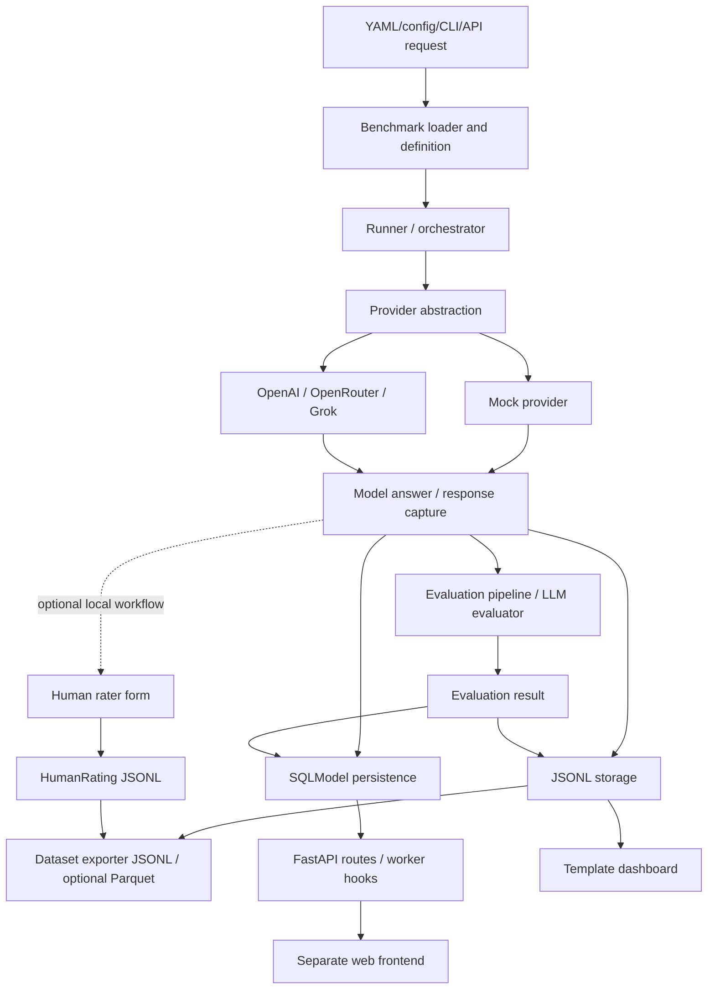

# SemantIQ Foundation and Canonicalization Report

**Organization:** Logorythmus  
**Approved product scope:** SemantIQ only  
**Date:** 2026-07-22  
**Mode:** Read-only evidence audit  
**Decision status:** Proposed; no local reconciliation or GitHub migration authorized

## A. Executive Decision

SemantIQ today is an experimental Python benchmark and evaluation platform with a CLI, FastAPI service, configurable benchmark execution, provider adapters, run/evaluation persistence, dataset export, a separate web frontend, and a small but real human-rating interface. It is more than a benchmark script, but it is not yet a complete multi-user benchmark or human-evaluation platform.

The recommended canonical strategy is **Strategy B: use `../SemantIQ` as the base and selectively recover only reviewed, provenance-clear work from the other variants**.

Why:

- `../SemantIQ` has the clearest platform boundary and contains the intended API, CLI, provider, persistence, worker, frontend, export, and human-rating surfaces in one package.
- It has a coherent eight-commit history tied to the earlier public `kaveh8866/SemantIQ` identity.
- `../SemantIQ-M-Benchmarks` contains valuable, tested benchmark-specific material—especially SMF, HACS, vision scoring, reproducibility/fingerprinting, report comparison, and inter-rater reliability utilities—but represents an alternative architecture and conflicting package/license identity.
- `../Sematiq 2` appears to be an unversioned historical/intermediate platform copy. It may contain isolated older work, but it cannot provide authoritative history.

Implementation may begin only after the dirty local variants are preserved and the human decisions in section Q are approved. GitHub migration may **not** begin yet.

The largest unresolved blocker is not repository naming. It is deciding the canonical product boundary and lawful provenance of the benchmark definitions, prompts, datasets, generated outputs, and selectively recoverable M-Benchmarks code.

### Existing GitHub destination

[`Logorythmus/SemantIQ`](https://github.com/Logorythmus/SemantIQ) already exists publicly. On 2026-07-22 it showed:

- default branch `main`;
- one commit;
- only `README.md` visible;
- no releases;
- a description claiming semantic-cognitive benchmarking of LLMs “& Human.”

That repository is an approved destination placeholder, not a migrated canonical product. Its public human-evaluation claim is broader than the evidence and should be corrected during implementation.

## B. Product Definition

```text
SemantIQ is:
An experimental benchmark and evaluation platform for running structured model
evaluations, recording responses and scores, and inspecting or exporting results.

SemantIQ exists because:
Researchers and developers need repeatable, inspectable evaluations that go beyond
a single accuracy number and can preserve the benchmark, provider, response, score,
and optional human judgment involved in a result.

SemantIQ is for:
AI researchers, model evaluators, developers, educators, and contributors who need
a programmable benchmark workflow through a CLI or API, with an experimental UI.

SemantIQ currently includes:
A Python package and CLI; benchmark loading and execution; provider adapters;
LLM-based evaluation; JSONL and SQL-oriented persistence; API routes; background-job
hooks; dataset export; a separate frontend; and a basic local human-rating workflow.

SemantIQ does not currently include:
A proven production service, complete authentication/authorization, multi-user
workspaces, mature reviewer assignment/queues, blind or pairwise review, consent
management, disagreement adjudication, or a validated general human-evaluation platform.

SemantIQ may include later:
Reviewed benchmark suites from the M-Benchmarks lineage, stronger reproducibility,
multi-evaluator workflows, inter-rater analysis, richer comparison/reporting, and a
maintained public web experience.
```

## C. Product Boundary

| Surface | Classification | First-public-release decision | Evidence summary |
|---|---|---|---|
| Python package `semantiq` | Core for first public release | Include after cleanup | `pyproject.toml`, `src/semantiq/` |
| CLI | Core for first public release | Include | `src/semantiq/cli.py`; `semantiq` console script |
| Benchmark loader/runner | Core for first public release | Include | `benchmarks/loader.py`, `runner/runner.py`, `runner/run.py` |
| Evaluation pipeline | Core for first public release | Include with experimental label | `evaluation/base.py`, `evaluation/llm_evaluator.py`, `evaluation/pipeline.py` |
| Provider adapters | Core but optional at runtime | Include mock/local-safe path; document network providers | `models/providers/base.py`, OpenAI, OpenRouter, Grok, mocks |
| JSONL storage | Core for first public release | Include | `storage/jsonl.py`, `storage/eval_jsonl.py`, `storage/human_jsonl.py` |
| SQL database models | Implemented but requires cleanup | Include only if clean validation proves supported path | `db/models.py`, `db/engine.py`, `db/seed.py` |
| Benchmark API | Core for intended platform; implemented but incomplete | Include as experimental | `api/main.py` routes for runs, results, benchmarks, studies, reports, metrics, prompts |
| Workers/queues | Optional and experimental | Defer from minimum local quick start | Redis/ARQ-related code in `worker.py`, `orchestrator/manager.py`, API enqueue calls |
| Dataset export | Optional but ready after provenance review | Include code; exclude unreviewed generated datasets | `export/dataset_exporter.py`, CLI `export-dataset`, tests |
| Basic human rater | Experimental optional surface | Include only with explicit limitations | `human_rater/`, schemas, JSONL storage, CLI, test |
| Dashboard templates | Experimental | Human decision: include or defer | `dashboard/` |
| Separate web frontend | Implemented but dirty/incomplete | Defer unless validated from preserved snapshot | `frontend/`; several modified and untracked pages |
| Benchmark/dataset YAML | Research/product content | Include only item-by-item after provenance review | `benchmarks/`, `datasets/`, `config/` |
| M-Benchmarks SMF/HACS/Vision suites | Research components/alternative implementation | Do not bulk import; selectively review later | `../SemantIQ-M-Benchmarks/benchmarks`, `datasets`, `prompts` |
| M-Benchmarks reliability metrics | Potential optional component | Candidate for selective recovery after dependency/license review | `evaluation/reliability/icc.py`, `krippendorff.py` and tests |
| Generated output JSONL/reports | Generated artifacts | Exclude initially unless deliberately curated and licensed | `outputs/`, `reports/`, `runs/` |
| Docker/cloud/infra | Development/deployment tooling | Include only supported local Docker path; defer unverified cloud deployment | Dockerfiles, compose, `infra/`, `worker/` |
| Authentication/multi-user | Planned/not found as complete product | Do not claim | API key dependency is not an identity/workspace system |

### Concise boundary

The smallest coherent product is the `semantiq` Python package, CLI, benchmark/evaluator/provider abstractions, local persistence, tests, and a documented experimental API. Human rating and the frontend are optional experimental surfaces, not the definition of the first release. Research suites and generated results are governed assets, not automatically part of the software distribution.

## D. Variant Comparison

### Summary

| Dimension | `../SemantIQ` | `../SemantIQ-M-Benchmarks` | `../Sematiq 2` |
|---|---|---|---|
| Role | Platform-oriented implementation | Benchmark-suite/research framework | Historical/intermediate platform copy |
| Git | Git root, 8 commits | Git root, 7 commits | Not a Git root |
| Remote | `kaveh8866/SemantIQ` | Same `kaveh8866/SemantIQ` remote | None |
| Branch | `main`, aligned with remote | `main`, aligned with remote reference | N/A |
| Working state | Dirty: 10 tracked modifications and 5 untracked frontend feature directories | Dirty: CLI web command and Vite webapp files deleted | Unversioned files; local DB/log/output artifacts present |
| Package | `semantiq` 0.1.0 | `semantiq-m-benchmarks` 0.1.0 | `semantiq` 0.1.0 |
| CLI | `semantiq` → `semantiq.cli:app` | `semantiq` → `cli.main:app` | CLI module present |
| Architecture | `src/` package, API, DB, worker, frontend | top-level CLI/pipeline/adapters/benchmarks/datasets/prompts | earlier `src/` platform layout |
| API | FastAPI runs/studies/reports/prompts/playground | No comparable product API found | Platform API surface unclear/older |
| Human evaluation | Basic rater UI/schema/JSONL/export | HACS is automated “Human-AI” scoring; reliability functions exist, but no full reviewer workflow | Older basic rater implementation |
| Frontend | Next-style frontend; dirty and expanding | Vite app files currently deleted in working tree | Older Next-style frontend |
| Benchmark depth | Generic/configurable loader and evaluator | Richer SMF, HACS, Vision registries/scorers/datasets | Generic older platform benchmark loader |
| Persistence | JSONL plus SQLModel and queue hooks | File/report/run-oriented pipeline and cache fingerprinting | JSONL, PostgreSQL interface, SQLModel |
| Providers | OpenAI, OpenRouter, Grok, mocks/base | OpenAI, OpenRouter, Marber, dummy/vision | OpenAI and mocks/factory |
| Tests | 22 test-named files observed | Broad scoring/pipeline/adapter/reliability tests | Small test set |
| License | MIT file and package metadata agree | Apache-2.0 LICENSE/README but `pyproject.toml` says MIT | No root license found |
| Outputs | Tracked Gemini JSONL output files plus local output area | reports/runs research artifacts | `semantiq.db`, dashboard/test logs |
| Documentation | Sparse root README, platform docs | Extensive research/governance/release docs | Moderate platform README/docs |

### Meaning of important differences

| Difference | Classification | Decision implication |
|---|---|---|
| Platform `src/semantiq` versus M-Benchmarks top-level framework | Alternative architecture; unsafe to merge automatically | Keep platform base; port only accepted capabilities through reviewed changes later |
| Both Git roots point to the same legacy remote but have unrelated commit sequences | Conflicting lineage | Preserve both histories before any transfer; do not force-push one over the other |
| `semantiq` and `semantiq-m-benchmarks` both install `semantiq` CLI | Conflicting product identity | One canonical distribution/CLI must own the name |
| M-Benchmarks Apache LICENSE versus MIT package metadata | License conflict | Resolve before copying any M-Benchmarks code/content |
| M-Benchmarks SMF/HACS/Vision suites | Valid specialized work, subject to provenance and scientific review | Candidate later modules; not automatic foundation content |
| M-Benchmarks ICC/Krippendorff utilities | Potential valid newer research work | Review dependencies, tests, license, statistical correctness before selective recovery |
| Platform basic human rater versus “HACS” automated scoring | Different concepts, not duplicates | Do not describe HACS as human-review workflow |
| Deleted M-Benchmarks webapp | Incomplete experiment/intentional removal unknown | Preserve deletion state; do not resurrect without a decision |
| Dirty platform frontend additions | Validity unknown; unsafe to assume canonical | Preserve patch/snapshot, then review feature-by-feature |
| `Sematiq 2` Postgres/storage/frontend code | Valid older work or stale alternative, unclear | Use as comparison/reference only; no authoritative history |
| `Sematiq 2/semantiq.db`, logs and outputs | Generated/local artifacts | Exclude |
| Minimal platform README versus extensive M docs | Documentation maturity mismatch | Write new evidence-based README; do not bulk-copy aspirational launch material |

## E. Capability Truth Table

Status reflects source evidence, not a freshly executed clean build.

| Capability | Status | Evidence | Variant | Public-release decision |
|---|---|---|---|---|
| CLI benchmark execution | Implemented | `src/semantiq/cli.py:28` `run`; runner modules | Platform | Core |
| Separate evaluation command | Implemented | `src/semantiq/cli.py:57`; evaluation pipeline | Platform | Core, experimental |
| Benchmark API | Partially implemented | `api/main.py` run/result/benchmark/study/report routes | Platform | Include as experimental after API test |
| Provider abstraction | Implemented | `models/providers/base.py` and concrete adapters | Platform | Core |
| Model execution | Implemented | runner plus OpenAI/OpenRouter/Grok/mock providers | Platform | Core with mock-first example |
| Response capture | Implemented | runner/run schemas and storage modules | Platform | Core |
| Evaluator system | Implemented | `evaluation/base.py`, `llm_evaluator.py`, `pipeline.py` | Platform | Core, methodology limitations documented |
| Semantic scoring | Partially implemented | evaluation schemas/criteria and LLM evaluator; M suites contain additional heuristic scorers | Both | Platform core only; review M scorers separately |
| Run persistence | Implemented | JSONL storage; `db/models.py` `RunDB` and `EvaluationDB` | Platform | Local path core; SQL path experimental |
| Result retrieval | Implemented | API `/runs/{run_id}` and `/results`; dashboard readers | Platform | Include |
| Result comparison | Prototype | M Vision CLI `compare`; platform has study/report surfaces but no general comparison contract proven | M/Platform | Defer from first-release claim |
| Report generation | Partially implemented | `reporting/generator.py`; API study report; M vision report files | Both | Experimental |
| Dataset management | Partially implemented | loader/config plus dataset exporter and metadata schemas | Platform | Include only reviewed datasets |
| Dataset export | Implemented | `export/dataset_exporter.py`; CLI command; test | Platform | Optional supported feature after validation |
| Human evaluation | Partially implemented | `human_rater/app.py`, `views.py`, schema/storage, CLI and test | Platform | Experimental; describe as local rating prototype |
| Rating/rubric system | Partially implemented | `HumanRating`, benchmark criteria, form submission; M rubric/scoring registries | Both | Include basic rating schema only after privacy review |
| Pairwise comparison | Not found | No canonical pairwise reviewer workflow evidence | — | Do not claim |
| Blind review | Not found | No concealment/assignment evidence | — | Do not claim |
| Reviewer queues | Not found | Rating view filters rated answers but no identity/assignment queue | Platform | Do not claim |
| Multiple evaluator disagreement | Prototype | M ICC/Krippendorff utilities; no integrated platform workflow | M | Defer/selectively review |
| Reviewer identity/audit | Not found as complete system | Rating schema exists but no accountable auth/consent/audit workflow proven | Platform | Block human-platform claim |
| Web frontend | Partially implemented | `frontend/src/app/*`; dirty additions; API proxy | Platform | Human decision; default recommendation defer |
| Template dashboard | Prototype | `dashboard/app.py`, `views.py` | Platform | Optional/defer |
| Authentication | Prototype | API-key dependency in API | Platform | State as simple API-key gate, not user authentication |
| Multi-user workspaces | Not found | No workspace/tenant model proven | — | Do not claim |
| Background workers | Partially implemented | Redis/ARQ enqueue in API/orchestrator and `worker.py` | Platform | Optional experimental deployment |
| Scheduling | Prototype | API `/schedules` route | Platform | Defer claim until integration test |
| JSONL export | Implemented | dataset exporter | Platform | Include |
| Parquet export | Partially implemented | optional pandas/pyarrow path, skips if unavailable | Platform | Document optional/experimental |
| Reproducible run fingerprint | Implemented in alternate architecture | `pipeline/cache.py` | M | Candidate selective recovery, not current platform claim |
| SMF suite | Implemented/experimental research component | M registries, CLI validation, scoring/tests | M | Defer pending provenance/methodology review |
| HACS suite | Implemented/experimental automated scoring | M HACS CLI/scoring/tests | M | Do not conflate with human ratings |
| Vision suite | Implemented/experimental research component | M vision renderer/scorer/report/compare/tests | M | Defer pending asset/provider/provenance review |

## F. Existing Architecture Map

### Platform architecture evidenced in `../SemantIQ`



### Architectural facts

- Benchmark-specific material is loaded from configuration/benchmark files through the loader and runner.
- Provider-specific logic is isolated behind `models/providers/base.py`, but provider configuration and network behavior still need clean validation.
- Evaluation is a separate pipeline abstraction, with an LLM evaluator as a concrete implementation.
- Human judgment enters through a separate local rater web form and is written to JSONL; it is not integrated as a mature assignment/adjudication subsystem.
- JSONL is the simplest evidenced local storage path. SQLModel plus Redis/ARQ paths form a more operationally complex optional service path.
- CLI can expose local operations independently. API and frontend introduce database, queue, and network configuration concerns.
- Export joins answers, AI evaluations, and optional human ratings into research datasets.

### Reproducibility and provenance risks

- Provider model/version, request parameters, transient provider behavior, and API response metadata may not be captured uniformly.
- LLM-as-judge scoring is provider/model/prompt-sensitive.
- M-Benchmarks has a run fingerprint mechanism, but it belongs to a different pipeline and is not evidence that the platform records equivalent provenance.
- Generated outputs are tracked without an approved redistribution/provenance policy.
- Human ratings lack a complete identity, consent, assignment, blinding, and adjudication model.
- Queue failure/retry behavior exists in code paths but was not validated.

### Decisions required before migration, not redesign proposals

1. Choose JSONL-only minimum versus including SQL/Redis worker mode in the first supported scope.
2. Decide whether the separate frontend is included or explicitly deferred.
3. Define the minimum provenance fields required for a result to be called reproducible.
4. Decide whether LLM-as-judge evaluation is the default, an optional evaluator, or only experimental.
5. Define whether human ratings are in first release and, if so, the privacy/consent boundary.
6. Decide which M-Benchmarks suites, if any, enter a later reviewed recovery backlog.

## G. Human Evaluation Assessment

**Conclusion: implemented but incomplete.**

This classification is narrower than “human-evaluation platform.” The platform contains:

- `HumanRating` and `HumanEvaluationResult` schemas;
- JSONL read/write/append functions;
- a local FastAPI rater application and form routes;
- filtering of already rated answer IDs;
- a CLI command to start the rater;
- dataset export that can include human ratings;
- at least one direct storage test.

M-Benchmarks also contains ICC and Krippendorff reliability functions and HACS research material, but these are not integrated into the platform’s human-rater workflow. “Human-AI Comparative Score” is automated benchmark scoring, not evidence of human reviewer operation.

```text
What a human evaluator can do today:
Open a local rater interface over a supplied answer file, submit criterion ratings
and comments, persist them to JSONL, avoid some already-rated answers, and include
ratings in an exported dataset.

What a human evaluator cannot do today:
Sign in through a proven identity system; receive assigned review queues; perform
verified blind or pairwise review; manage consent; coordinate multiple raters;
adjudicate disagreement; inspect a complete audit trail; or operate in a validated
multi-user workspace.

What must be added before describing SemantIQ as a human-evaluation platform:
A reviewed privacy/consent model, evaluator identity or documented anonymity model,
assignment and queue semantics, blinding/pairwise modes if claimed, multi-rater
aggregation and disagreement handling, audit/export rules, access control, and
end-to-end tests with representative human-review workflows.
```

The current public GitHub description should therefore say “optional experimental human ratings,” not imply general benchmarking of humans.

## H. Canonical Source Strategy

### Recommendation: Strategy B

Use `../SemantIQ` as the canonical base after preserving its dirty state. Selectively recover reviewed work from M-Benchmarks only through ordinary, attributable changes after the base is clean and validated.

### Why the base is strongest

- Matches intended product breadth without requiring future capability to define the current product.
- Uses a conventional installable `src/semantiq` package.
- Owns the intended `semantiq` package and CLI identity.
- Contains CLI, API, local storage, DB/worker hooks, export, frontend, and human-rater prototype.
- Has coherent existing public history and an MIT declaration consistent with package metadata.

### What it lacks

- Truthful newcomer README and maturity/limitations statement.
- A settled supported deployment profile.
- Reviewed benchmark/dataset/output provenance.
- General result comparison and robust reproducibility metadata.
- Mature reviewer workflows.
- A clean, reviewed frontend snapshot.
- Clean-clone validation for the exact intended release.

### Source disposition

| Source | Role | Preserve history? | Recover work? | Migration action |
|---|---|---:|---:|---|
| `../SemantIQ` | Canonical base candidate | Yes | Preserve dirty work after explicit snapshot plan | Clean and validate only in later authorized phase; use as source lineage |
| `../SemantIQ-M-Benchmarks` | Alternative benchmark/research lineage | Yes, separately | Yes, selectively after license/provenance/scientific review | Never bulk merge; preserve branch/bundle/archive separately, then port approved capabilities |
| `../Sematiq 2` | Unversioned historical/intermediate copy | No authoritative Git history exists | Only if a unique, reviewed capability is proven | Exclude local DB/logs/outputs; use comparison report before archival |
| `Logorythmus/SemantIQ` | Existing public destination placeholder | Preserve its one commit | Replace/merge strategy requires approval | Keep unchanged until migration plan is approved |

### Must not be imported automatically

- `.env` or any local provider/database settings;
- caches, databases, logs, generated outputs, reports, run directories;
- M-Benchmarks code until its Apache/MIT conflict is resolved;
- benchmark datasets/prompts without provenance records;
- deleted M-Benchmarks webapp merely because an older commit contains it;
- launch/DOI/governance claims that do not reflect current organization reality;
- alternate README claims not supported by the selected implementation.

### History preservation method

Before implementation, create non-destructive recoverable references for both Git variants and a content inventory for the non-Git variant. The later migration should preserve `../SemantIQ` commit ancestry and should import reviewed M work as attributable commits or patches, not by rewriting the base history. The existing one-commit Logorythmus placeholder requires an explicit merge/replacement strategy; no force push should be assumed.

## I. Repository Identity Recommendation

| Identity element | Recommendation | Rationale |
|---|---|---|
| Repository | `Logorythmus/SemantIQ` | Already exists and matches approved display identity |
| Canonical capitalization | **SemantIQ** in prose; `semantiq` in code/commands | Preserves brand while following package conventions |
| Python distribution | `semantiq` | Already declared by canonical base |
| Python import | `semantiq` | Existing package path |
| CLI command | `semantiq` | Existing entry point; avoid competing M CLI |
| API identity | “SemantIQ API” | Plain and consistent; version API separately later if needed |
| Frontend display | “SemantIQ” | Avoid a separate product identity |
| Version source | Python package metadata, with one runtime-accessible version | Avoid divergent README/dataset/frontend versions |
| M-Benchmarks name | Research lineage/suite family, not separate public product for this phase | Human-approved single-product scope |

### Proposed repository description

> An experimental benchmark and evaluation platform for researchers and developers to run, inspect, and compare structured model evaluations with optional human ratings.

### Proposed topics

`llm-evaluation`, `ai-benchmarking`, `semantic-evaluation`, `model-evaluation`, `python`, `fastapi`, `human-evaluation`, `open-source`

Use `human-evaluation` only if the README prominently states that the current human-rating workflow is experimental and incomplete.

## J. License and Provenance Register

| Asset or group | Intended owner/source | License status | Public-release decision | Required action |
|---|---|---|---|---|
| Canonical Python source | SemantIQ contributors / legacy repo history | MIT file and metadata agree | Include after scan | Confirm authorship and copied-code audit |
| Canonical frontend | SemantIQ contributors plus npm dependencies | Repository MIT likely applies to original code; dependency licenses separate | Conditional | Preserve dirty work, run dependency-license review, verify asset provenance |
| Canonical infrastructure/scripts | SemantIQ contributors and referenced images/tools | MIT assumed only for original code | Conditional | Review Terraform/Docker snippets and notices |
| M-Benchmarks source | SemantIQ-M contributors/history | **Conflict:** Apache LICENSE/README versus MIT `pyproject.toml` | Exclude until resolved | Human/legal decision; identify authorship per commit/file |
| `Sematiq 2` source | Unknown lineage | No root license observed | Exclude by default | Prove origin and relationship before recovery |
| Canonical benchmark definitions | Local project authors or unknown inputs | Repository license does not establish scientific/content provenance | Conditional | Inventory author, source, license, citation, modification rights |
| M SMF/HACS/Vision definitions | Research lineage; individual origins unclear from high-level audit | Unresolved | Exclude initially | Item-level provenance and methodology review |
| Prompt collections | Project/third-party/unknown | Unresolved; prompts may quote protected material | Exclude unless reviewed | Record source, author, license, citation and provider compatibility |
| Dataset files | Project/third-party/unknown | Repository MIT is insufficient | Exclude unreviewed sets | Add dataset cards and explicit licenses |
| Canonical generated Gemini outputs | Provider-generated content | Unknown redistribution terms and input provenance | Exclude initially | Review content, provider terms, prompts, privacy; regenerate synthetic fixtures if needed |
| M reports/runs/results | Generated research artifacts | Mixed/unknown | Exclude initial source release | Curate separately with provenance metadata |
| Logos/images/screenshots | Unknown from current high-level evidence | Unresolved | Exclude unless rights documented | Asset inventory and license record |
| Written research/governance docs | Repository contributors | Depends on lineage/license resolution | Selective | Separate current fact, research proposal, and historical material |
| SemantIQ name/branding | Existing public identity | Trademark/ownership not documented | Use provisionally | Human confirms ownership and desired capitalization |

## K. Security and Privacy Register

No secret values are reproduced. Findings are filename/category assessments, not proof of exposure.

| Severity | Location | Category | Assessment | Required action |
|---|---|---|---|---|
| High | `../SemantIQ/.env` | Local configuration | Ignored local file exists; contents intentionally not reported | Confirm never tracked in any history; rotate credentials if provenance is uncertain |
| High | `../Sematiq 2/semantiq.db` | Local database | Generated DB may contain run/config/output data | Exclude; inspect schema/data privately before deletion or archival decision |
| High | `../SemantIQ/outputs/run_gemini.jsonl`, `scores_gemini.jsonl` | Model prompts/responses/scores | Tracked generated outputs; privacy/provider rights unknown | Exclude until reviewed; use synthetic fixtures for tests |
| Medium | Canonical `.github/workflows/*.yml` | Credential references | Heuristic matches likely GitHub secret expressions, not confirmed values | Manual and history-aware secret scan |
| Medium | `config/config.yaml`, `examples/config.toml`, compose/cloud/infra files | Provider/database configuration | May contain placeholders, endpoints, or insecure defaults | Review defaults; use environment-variable placeholders; document local-only assumptions |
| Medium | Provider adapters and frontend settings/API files | API key/token handling | Expected credential-handling code; no confirmed literal secret | Verify validation, redaction, server/client boundaries, and error messages |
| Medium | `security/logging.py`, worker/API code | Prompt/output logging | Logs may expose prompts, responses or identifiers | Define redaction and retention rules; add negative tests |
| Medium | Human rating JSONL/export schema | Reviewer data/privacy | Free-text feedback and possible evaluator identifiers can become personal data | Define minimum fields, consent, pseudonymization, retention and export warnings |
| Medium | Uploaded/imported datasets and prompts | Sensitive/third-party data | No complete intake/provenance/privacy gate established | Add dataset acceptance checklist before public uploads |
| Medium | `../SemantIQ-M-Benchmarks` reports/runs/datasets/ratings | Research participant/model data | Provenance and sensitivity not fully assessed | File-level review; exclude by default |
| Medium | `../Sematiq 2/dashboard_log.txt`, `test_output.txt` | Logs/output | Generated local artifacts may reveal paths/config/data | Exclude; review privately |
| Low | Cache directories (`.pytest_cache`, `.ruff_cache`) | Local artifacts | Present locally, ignored in canonical checkout | Exclude and verify not in history |
| Low | Absolute path scan | Machine-specific paths | No canonical platform matches were reported by prior heuristic scan; not a complete guarantee | Re-run on final staged tree and history |

Required pre-publication control: a history-aware secret/privacy scan of all preserved histories, followed by manual review of findings. It must be performed in a later authorized phase with outputs kept private.

## L. Proposed First Public Repository

### Mandatory first-release files and product core

| Item | Purpose | Exists? | Readiness | First release |
|---|---|---:|---|---:|
| `README.md` | Truthful front door | Yes, inadequate | Rewrite required | Yes |
| `LICENSE` | Source license | Yes | Canonical MIT is internally consistent | Yes |
| `CONTRIBUTING.md` | Contribution path | Yes | Review against Logorythmus standard | Yes |
| `CODE_OF_CONDUCT.md` | Community expectations | Yes | Review contact/enforcement route | Yes |
| `SECURITY.md` | Private vulnerability route | Yes | Needs real security contact and response scope | Yes |
| `CHANGELOG.md` | Release history | Yes | Verify against history | Yes |
| `pyproject.toml` | Package/build identity | Yes | Resolve supported extras and version | Yes |
| `src/semantiq/` | Product package | Yes | Preserve dirty work; clean validation needed | Yes |
| `tests/` | Executable evidence | Yes | Clean run needed; add API/human-flow gaps later | Yes |
| `benchmarks/` | Benchmark definitions | Yes | Provenance/methodology review required | Only approved items |
| `examples/` | Smallest usable examples | Yes | Sanitize configuration and verify | Yes, minimal set |
| `docs/` | Concepts/guides/reference/architecture | Yes | Reclassify and remove contradictions | Yes, curated |
| `.github/` | CI/community templates | Yes | Simplify and validate | Yes |

### Optional surfaces

| Item | Decision | Reason |
|---|---|---|
| `frontend/` | **Default: defer**, unless dirty work is preserved and a clean build/API flow is proven | Avoid making an incomplete UI define product readiness |
| `src/semantiq/human_rater/` | Include as experimental if privacy boundary and local smoke test pass | Real but incomplete capability |
| `src/semantiq/dashboard/` | Defer or include as experimental; human decision | Overlaps with separate frontend and may confuse public UI story |
| `src/semantiq/api/` | Include as experimental | Central intended surface with meaningful existing routes |
| `src/semantiq/db/`, worker/orchestrator | Include code only if optional extras and architecture are coherent | Must not burden minimum local example |
| `datasets/` | Include only licensed sample/synthetic set and dataset cards | Content licensing differs from code |
| `infra/`, cloud compose, worker deployment | Defer unverified cloud claims; keep only validated local tooling | First release should have one reliable path |

### Exclude from initial publication/import

- `.env`, frontend environment files, caches, local databases and logs;
- `outputs/`, `reports/`, `runs/`, provider-derived generated results unless explicitly curated;
- M-Benchmarks launch/DOI/communication kits and unapproved datasets/prompts;
- obsolete/deleted webapp material;
- duplicated architecture/release documents;
- any file without established provenance or a current role.

### Target shape

```text
SemantIQ/
├── README.md
├── LICENSE
├── CONTRIBUTING.md
├── CODE_OF_CONDUCT.md
├── SECURITY.md
├── CHANGELOG.md
├── pyproject.toml
├── src/
│   └── semantiq/
├── tests/
├── benchmarks/          # approved definitions only
├── datasets/            # licensed sample data + dataset cards only
├── examples/            # sanitized, verified examples
├── docs/
│   ├── concepts/
│   ├── guides/
│   ├── reference/
│   ├── architecture/
│   ├── proposals/
│   └── history/
├── frontend/            # only if inclusion gate passes
└── .github/
```

## M. Repository Standard v0.1

This standard emerges from SemantIQ’s real needs and is not a theoretical organization constitution.

| Practice | Classification | SemantIQ application |
|---|---|---|
| README begins with purpose, users, maturity and one start path | Required for SemantIQ; likely reusable | Correct current one-line/vision imbalance |
| Explicit “works today / experimental / not implemented” | Required; likely reusable | Prevent human-evaluation and platform overclaiming |
| `KNOWN_LIMITATIONS.md` or prominent README section | Required; likely reusable | Record provider, reproducibility, UI, human-review limits |
| Root license plus asset/dataset provenance records | Required; likely reusable | Code license does not govern datasets/outputs |
| `CONTRIBUTING`, Code of Conduct, Security route | Required; likely reusable | Name real contacts and response expectations |
| AI collaboration disclosure in PR template | Required; likely reusable | Contributor remains accountable for AI-assisted work |
| Issue forms: question, problem, idea | Required; likely reusable | Keep early contribution flow simple |
| PR template: why, change, validation, data/provenance, AI use, open questions | Required; partially SemantIQ-specific | Benchmark changes need methodology/data review |
| Docs hierarchy: concepts/guides/reference/architecture/proposals/history | Required; likely reusable | Separate behavior from vision/history |
| Benchmark/dataset card requirement | SemantIQ-specific | Record purpose, source, license, version, evaluation limits |
| CI job names: `lint`, `test`, `package`, optional `frontend` | Required; naming likely reusable | Stable branch-rule targets |
| Mock-provider smoke benchmark | SemantIQ-specific | Validate without paid API or secrets |
| Maturity label and release notes | Required; likely reusable | Begin at experimental/alpha unless gate changes |
| Default branch PRs, no force push/delete, resolved conversations | Required; likely reusable | Protect foundation history |
| One human approval | Human decision based on reviewer availability | Do not fake independent review if only one maintainer exists |
| Labels: type/status plus `area: benchmarks`, `area: api`, `area: human-evaluation`, `area: data` | Required; partly SemantIQ-specific | Small controlled vocabulary |
| Organization Discussions | Defer until contributor route exists | Issues can handle initial actionable work |
| Project board | Defer until real backlog volume exists | Avoid administrative theater |
| Automated stale closure | Defer until contributors arrive | Questions should not be closed mechanically |

## N. README Truth Model

1. **SemantIQ**
   - One sentence: experimental benchmark/evaluation platform.
   - Primary users.
   - Maturity: experimental/alpha.
   - One mock-provider quick-start link.
2. **Why SemantIQ exists**
   - Human evaluation problem before architecture.
3. **What works today**
   - CLI execution, provider abstraction, evaluation, local storage/export, experimental API.
4. **What is experimental or not implemented**
   - Human rater, frontend, SQL/queue deployment, comparison, multi-user review.
5. **Smallest useful example**
   - Install in a clean environment.
   - Run one synthetic benchmark with mock provider.
   - Inspect generated answer/result.
6. **Benchmark pipeline**
   - Source → definition → provider → answer → evaluator/human rating → storage → output.
7. **CLI**
   - Supported commands and stable/experimental markers.
8. **API**
   - How to start locally; route scope; API-key limitation; no multi-user claim.
9. **Frontend status**
   - Included and validated, or explicitly deferred.
10. **Human evaluation status**
    - Exact “implemented but incomplete” statement and privacy warning.
11. **Providers**
    - Mock first; network providers require user credentials and may transmit data.
12. **Benchmarks, datasets and provenance**
    - Cards, licenses, citations and versioning.
13. **Reproducibility and known limitations**
    - Provider nondeterminism, LLM judge sensitivity, missing workflow capabilities.
14. **Documentation map**
    - Concepts, guides, reference, architecture, proposals/history.
15. **Contributing**
    - Questions welcome; benchmark/data methodology expectations.
16. **AI collaboration**
    - Disclosure, verification, provenance and human accountability.
17. **Security and privacy**
    - Reporting route; prompts/outputs/provider transmission; human data.
18. **License**
    - MIT for approved source; separate terms for datasets/prompts/outputs where applicable.

Do not lead with badges, a large diagram, claims of production readiness, or “benchmarking humans.”

## O. Sequenced Implementation Backlog

No item below is authorized by this report.

| Stage / item | Objective | Dependency | Main risk | Evidence of completion | Human approval? |
|---|---|---|---|---|---:|
| 1. Protect: preserve dirty platform state | Ensure modified/untracked work cannot be lost | None | Accidental omission or publication | Private patch/bundle/reference plus inventory and checksum | Yes |
| 1. Protect: preserve M lineage and non-Git inventory | Retain alternative history without merging | None | History collision | Recoverable Git reference and file inventory | Yes |
| 1. Protect: exclusion manifest | Name env, DB, logs, caches, outputs and private assets | Preserved sources | Sensitive publication | Reviewed exclusion list | Yes |
| 1. Protect: secret/privacy scan | Find working-tree and historical risks privately | Preserved histories | Credential exposure | Redacted scan report; all High findings resolved | Yes for remediation |
| 1. Protect: license/provenance decision | Resolve M conflict and content rights | Asset inventory | Unlawful redistribution | Signed-off provenance register | Yes |
| 2. Canonicalize: approve base and history route | Make platform checkout authoritative | Stage 1 | Overwriting placeholder/lineage | Approved ancestry/import plan | Yes |
| 2. Canonicalize: classify dirty changes | Accept, defer or reject each working change | Preservation complete | Feature creep | Decision log and clean intended tree | Yes for scope |
| 2. Canonicalize: M recovery backlog | Identify isolated capabilities, not files to dump | License/provenance resolved | Architectural contamination | Per-capability issues with evidence/owner | Yes |
| 2. Canonicalize: identity consistency | Align repo, package, CLI, API and version | Base approved | Broken links/packages | One identity matrix and automated version check | Yes |
| 3. Make truthful: README and limitations | Make first screen accurate | Scope decisions | Overclaiming | README matches capability table and validated commands | Yes |
| 3. Make truthful: documentation classification | Separate current docs, proposals and history | Canonical tree | Vision presented as fact | Link-checked docs map and labels | No, except exclusions |
| 3. Make truthful: human-rating statement | Define exact current status/privacy boundary | Human-surface decision | Participant/privacy harm | Reviewed human-evaluation limitations page | Yes |
| 4. Validate: clean install/package | Prove supported Python setup | Canonical clean tree | Hidden local dependencies | Fresh environment install and package metadata record | No |
| 4. Validate: lint/tests | Establish executable baseline | Install | False green/untested paths | Recorded lint/test results and failures resolved or disclosed | No |
| 4. Validate: mock benchmark | Prove smallest useful offline flow | Tests | Paid provider/secret dependence | Reproducible mock run with documented output schema | No |
| 4. Validate: API | Prove local run/result route flow | DB mode decision | Queue/DB complexity | API smoke test in documented configuration | No |
| 4. Validate: frontend gate | Decide inclusion based on actual build and workflow | Dirty frontend disposition/API | UI blocks release | Build plus end-to-end path, or explicit defer decision | Yes if included |
| 4. Validate: human-rater gate | Prove local rating/export flow | Privacy decision | Data handling | End-to-end synthetic rating test and limitation docs | Yes if included |
| 5. Open-source foundation: community files | Establish human contribution routes | Maintainer/contact named | Empty or misleading contacts | Reviewed files and reachable private routes | Yes |
| 5. Open-source foundation: issue/PR templates and labels | Make questions and provenance visible | Community policy | Process burden | Trial issues/PR render correctly | No |
| 5. Open-source foundation: CI and rules | Protect `main` with real checks | Stable validation commands | Lockout/flaky checks | Passing checks and documented bypass owner | Yes for rules |
| 6. Migrate: integrate with existing destination | Preserve histories without destructive force | All prior gates | Public data loss/history rewrite | Reviewed import PR/branch and commit graph | Yes |
| 6. Migrate: private readiness review if feasible | Verify final repository settings/content | Destination strategy | Placeholder is already public | Final public-content diff and settings checklist | Yes |
| 7. Open: transparent status/release | Announce exact maturity and limitations | Migration validation | Premature trust | Tagged pre-release/status post with known limitations | Yes |
| 7. Open: genuine starter issues | Invite bounded contributions | Docs/CI stable | Unmaintainable promises | 2–5 reproducible, owned issues | No |
| 7. Open: observe friction | Improve based on people, not theory | Public use | Premature automation | 30–60 day question/friction review | No |

## P. Migration Readiness Gate

| Requirement | State | Evidence | Required next action |
|---|---|---|---|
| Product definition approved | Human decision | Proposed in B | Maintainer approves or edits |
| Canonical source selected | Human decision | Strategy B recommended | Approve `../SemantIQ` base |
| Other variants preserved | Blocked | Dirty M tree; non-Git alternate | Authorized preservation step |
| Repository name approved | Ready | Existing `Logorythmus/SemantIQ` | Confirm capitalization only |
| Package/CLI identity approved | Human decision | Both lineages compete for `semantiq` CLI | Approve platform ownership |
| License resolved | Blocked | M Apache/MIT conflict; alternate unlicensed | Legal/provenance resolution |
| Dataset provenance resolved | Blocked | No complete dataset cards/licenses | Inventory and approve each included dataset |
| Generated outputs reviewed | Blocked | Tracked Gemini output and other runs | Exclude or approve after content/terms review |
| Secrets/privacy risks resolved | Blocked | Ignored `.env`, logs/DB/output risks; no history scan | Private full-history review |
| Git history strategy approved | Human decision | Two histories plus one-commit destination | Approve non-destructive integration method |
| README model approved | Human decision | Outline in N | Approve before prose rewrite |
| Documentation classified | Blocked | Proposed categories only | File-level implementation |
| Clean install verified | Blocked | Not run under read-only restriction | Run later in clean environment |
| Build/package verified | Blocked | Structural evidence only | Package build/install validation |
| Tests verified | Blocked | Tests inspected, not executed | Run canonical suite cleanly |
| Minimal benchmark verified | Blocked | CLI path exists | Execute mock benchmark and record result |
| API verified | Blocked | Routes exist | Smoke test chosen local DB mode |
| Frontend inclusion decided | Human decision | Dirty implemented surface | Include gate or defer |
| Human evaluation status approved | Human decision | “Implemented but incomplete” assessment | Approve wording and first-release inclusion |
| Maintainer named | Blocked | No explicit accountable human confirmed | Name maintainer |
| Security contact named | Blocked | Policy file exists but actual route unverified | Name private contact |
| First public scope approved | Human decision | Proposed in C/L | Approve exact inclusion/exclusion list |

**Implementation readiness:** Blocked pending human scope/history decisions and preservation.  
**GitHub migration readiness:** Blocked.  
**Public release readiness:** Blocked.

## Q. Human Decision Gate

Only the following decisions require the human maintainer:

- [ ] Approve the product definition and the experimental/alpha maturity label.
- [ ] Approve Strategy B with `../SemantIQ` as the canonical base.
- [ ] Approve the non-destructive preservation method for both Git histories and the non-Git variant.
- [ ] Decide whether the platform package owns the `semantiq` distribution and CLI identity.
- [ ] Resolve the Apache-2.0/MIT conflict for any M-Benchmarks material and authorize only provenance-clear recovery.
- [ ] Approve which benchmark definitions, prompts, and datasets may be public and under what licenses/citations.
- [ ] Decide whether tracked/generated model outputs are excluded or curated for publication.
- [ ] Decide whether the separate frontend belongs in the first release; default recommendation is defer.
- [ ] Decide whether the basic human-rater surface belongs in the first release and approve the “implemented but incomplete” description and privacy boundary.
- [ ] Decide whether SQL/Redis workers are supported first-release surfaces or experimental/deferred.
- [ ] Approve the exact repository inclusion/exclusion manifest.
- [ ] Approve how the canonical history will be integrated with the existing one-commit public `Logorythmus/SemantIQ` repository without destructive rewriting.
- [ ] Confirm the SemantIQ name/capitalization and ownership of its branding.
- [ ] Name the accountable maintainer and private security contact.
- [ ] Approve the README truth model and Repository Standard v0.1.
- [ ] Explicitly authorize the implementation phase; this report does not do so.

---

**Stop condition reached.** This report focuses only on SemantIQ. It does not modify or reconcile any variant, create branches or commits, change GitHub, write product code, or begin another product analysis.
